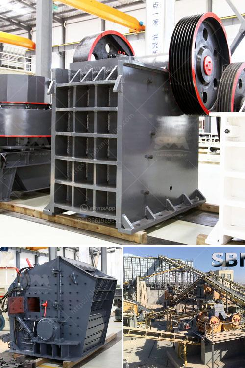

<h3>stone crusher plant in punjab</h3>
Punjab is a northwestern state in India, bordering with Pakistan and the state of Jammu and Kashmir. The state is a significant producer of sand, gravel, and crushed stone due to its geographical location. Stone crusher plant in Punjab plays a crucial role in the processing of these minerals and promotes their development.

In the district of Pathankot, Punjab, the VSI crusher (Vertical Shaft Impactor crusher) is commonly used as sand making machine. With its rotor structure, the VSI crusher is able to produce cubic-shaped aggregates. The stone crusher plant in Punjab is the perfect process for making sand, as the stones are broken down into smaller sizes and then subjected to various processes to produce sand.

Various manufacturers and suppliers offer distinctive stone crusher plant in Punjab options. For instance, Hazemag produces robust stone crushing units that are built to last for decades. Hazemag is a German engineering company that specializes in producing impact crushers, which are predominantly used in the production of sand for the construction industry.

Another reputable company, Metso, offers a wide range of stone crusher plant in Punjab products that are ideal for various crushing applications. Metso's portfolio includes jaw crushers, cone crushers, vertical shaft impactors, and screens, all designed with durability and productivity in mind.

The stone crusher plant in Punjab provides an economical and environmentally friendly solution for contractors to produce their own crushed stones. The Punjab government has invested millions of dollars in various infrastructure projects and road networks, which requires a large amount of sand and aggregates.

Additionally, the stone crusher plant in Punjab is also used in various industries such as mining, cement, construction, chemical, power generation, and so on. It is an essential equipment in both sand making process and stone crushing process.

If you are interested in purchasing a stone crusher plant in Punjab, the requirement for purchasing one is relatively simple. Just ensure the product size requirements you need are met and the product meets the desired specifications. With the right machine, you can produce high-quality sand and aggregates that meet the needs of various construction projects in Punjab.

In conclusion, stone crusher plant in Punjab is an economical and worthwhile investment for contractors. It not only helps in generating revenue but also functions as a vital raw material for various projects and industries. The stone crusher plant in Punjab plays a crucial role in the processing of sand and gravel, promoting the development of the construction industry in the region.
<h3>Contact us</h3><ul><li><strong>Whatsapp:&nbsp;<a href="https://wa.me/8613661969651">+8613661969651</a></strong></li><li><a href="https://swt.shibang-china.com/?git&amp;zhl&amp;stone crusher plant in punjab"><strong>Online Service(chat now)</strong></a></li></ul><h3>Related</h3><ul><li><a href='granite rock crusher.md'>granite rock crusher</a></li><li><a href='slag crushing machine hopper in india.md'>slag crushing machine hopper in india</a></li><li><a href='jaw crusher calculating.md'>jaw crusher calculating</a></li><li><a href='coal mill company in srilanka.md'>coal mill company in srilanka</a></li><li><a href='limestone crushing machine.md'>limestone crushing machine</a></li></ul>