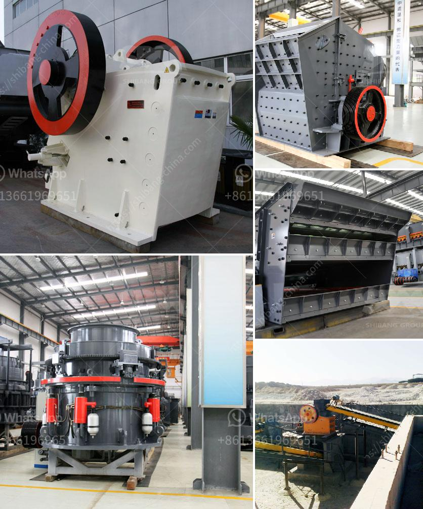

<h3>stone crusher plant layout</h3>
Stone crusher plant layout, also known as crushing screening plant, is available in several types depending on the requirements of the users. Some of the common layouts for stone crusher plants include:

1. Aggregates crushing plant layout: The layout of the crushing plants is usually designated in the form of a rectangular shape with bunkers, hopper, crushers, screens, and conveyors. These are portable or semi-fixed equipment. A crusher is mounted on a concrete pedestal along with other equipment. The entire process is carried out in a closed circuit, ensuring minimal dust emission and noise pollution.

2. Sand and gravel plant layout: Similar to the aggregates layout, this layout consists of crushers, screens, conveyors, and hoppers. The primary crusher crushes the raw material, which is then transported to the secondary crusher. After the secondary crusher, the material is screened for its desired size. The final product is then stored in various storage bins or stockpiles.

3. Stone crushing plant layout: The primary crushers are commonly located near the quarry face, where the blasted rocks are initially extracted and deposited. The materials are then loaded into dump trucks or front-end loaders and transported to a primary crusher. The crushed material is then transported by conveyors to secondary and tertiary crushers for further processing. The final product is usually segregated into various sizes by screens before being transported to the final storage area.

Stone crusher plant layout is crucial because it affects the efficiency and effectiveness of the entire production line. The key components of a stone crushing plant are the primary crusher, secondary crusher, vibrating screen, conveyor belts, and vibrating feeders. These equipment work together to process the stones into the desired sizes. 

Choosing the correct layout for a stone crusher plant is essential because it determines the final products' quality and consistency. Additionally, a well-designed layout can also maximize the production capacity and minimize the production cost.

In conclusion, stone crusher plant layout plays a crucial role in the production of high-quality finished products. It is essential to choose a layout that suits the specific requirements of the project, such as the type of raw materials, production capacity, and final product size. Consulting with experienced professionals can help determine the most suitable layout for a stone crusher plant.
<h3>Contact us</h3><ul><li><strong>Whatsapp:&nbsp;<a href="https://wa.me/8613661969651">+8613661969651</a></strong></li><li><a href="https://swt.shibang-china.com/?git&amp;zhl&amp;stone crusher plant layout"><strong>Online Service(chat now)</strong></a></li></ul><h3>Related</h3><ul><li><a href='mobile crusher datasheet.md'>mobile crusher datasheet</a></li><li><a href='pf trituradora de impacto.md'>pf trituradora de impacto</a></li><li><a href='how much does a crusher.md'>how much does a crusher</a></li><li><a href='stone crushing business in zimbabwe.md'>stone crushing business in zimbabwe</a></li><li><a href='used coal wash plant canada for sale.md'>used coal wash plant canada for sale</a></li></ul>