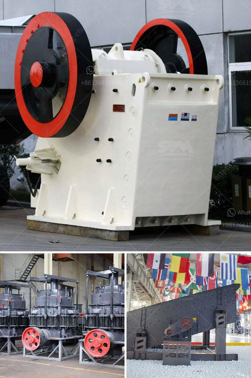

<h3>stone crusher plant price</h3>
Since stone crushing is an industry that has been around for a long time, it is common to find plants of different sizes and models. This article explores the stone crusher plant price and models available for purchase. The price range varies depending on the model and capacity of the plant.

The price of a small portable stone crusher plant differs from model to model and capacity. The models with the capacity of 20-50 tons per hour are: PE-250*400, PE-400*600, PE-600*900, etc. Due to the different equipment configuration, maintenance and repair costs, labor costs, transportation costs, and other aspects, there will be different prices. The specific price can be consulted by the manufacturer or supplier.

Stone crusher plant price also varies with different types and capacities. Configuration and Duoling( DL Crusher) will have a range of mobile jaw crushers, cone crusher plants, portable impact crushers, portable jaw crushers, vibrating feeders, vibrating screens, etc. They are designed to be used alone or with other equipment.

The price of a stone crusher plant varies depending on the capacity and compression force required. Different capacity levels and corresponding models have different prices. If you choose a large stone crusher plant with a capacity of 300-500 tons/hour, fixed processing equipment will generally be more expensive than mobile equipment. However, mobile equipment is more convenient in terms of transportation and maintenance.

Stone crusher plant prices are also affected by factors such as input and output materials, labor costs, transportation costs, and machine maintenance costs. To this end, it is advisable to consult manufacturers and suppliers in order to get a more accurate price. When choosing a stone crusher plant, it is important to consider its intended use, and choose the right model accordingly.

In conclusion, there are various types and models of stone crusher plants in the market. Therefore, it is advisable to consult manufacturers and suppliers to determine the type and model that best suits your needs. The capacity and configuration of the plant will affect its price, so it is important to consider your budget and requirements. By doing thorough research and getting advice from professionals, you can find a stone crusher plant that fits your needs and budget.
<h3>Contact us</h3><ul><li><strong>Whatsapp:&nbsp;<a href="https://wa.me/8613661969651">+8613661969651</a></strong></li><li><a href="https://swt.shibang-china.com/?git&amp;zhl&amp;stone crusher plant price"><strong>Online Service(chat now)</strong></a></li></ul><h3>Related</h3><ul><li><a href='dry grinding mill.md'>dry grinding mill</a></li><li><a href='coal roller mill.md'>coal roller mill</a></li><li><a href='mobile crushing and screening zimbabwe.md'>mobile crushing and screening zimbabwe</a></li><li><a href='talc powder grinding mills in lahore.md'>talc powder grinding mills in lahore</a></li><li><a href='denver lab jaw crusher.md'>denver lab jaw crusher</a></li></ul>