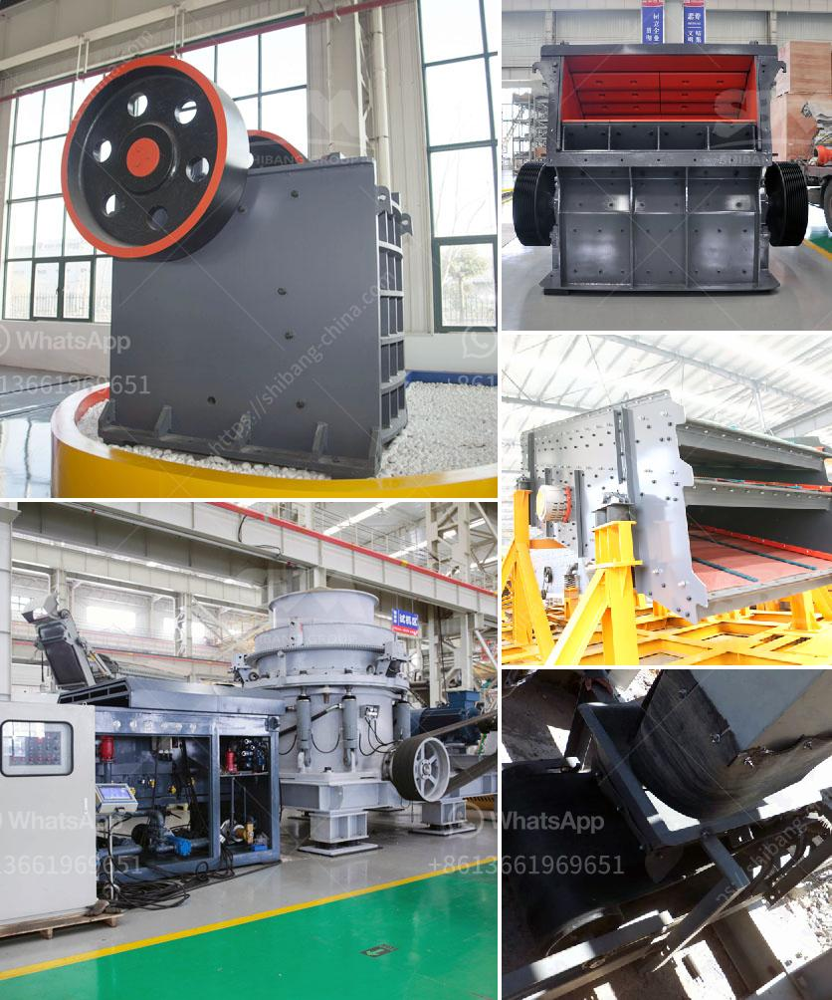

<h3>stone crusher plant video</h3>
Stone crusher plant has integrated unit equipment installation form, which could reduce the complex site infrastructure installation work of the component parts, and reduces the consumption of materials and working hours. The reasonable and compact space stone crusher plant layout of the unit enhances the flexibility of the site.

With the development of the stone crushing machine, the occurrence of new materials and advanced techniques, more and more granite crushers are manufactured in the market, and the differences in their prices are widening.

This article will compare the common crushers in this market based on the features of granite, and help you choose the best and most reasonable granite crusher.

Granite is a kind of igneous rock, also known as acid crystalline plutonic rock, which belongs to hard stone. It is made of feldspar, quartz, and a small amount of mica.

Granite is dense and has a granular structure. The main component of granite is silica, which is acid-resistant and wear-resistant. It has the advantages of high hardness, good compression resistance, and long service life.

As we all know, crushing machine occupies a large proportion in the whole mining machinery industry, so it is significant to know the differences between different types of rock crushers.

The stone crusher plant video shows our hard stone crusher in action. In this video, the hard stone crusher is configured with an integrated Impact crusher, known as the "working poor man's steel mill" because its structure is simple and affordable, and the horsepower requirements are not that heavy.

The work efficiency of the stone crusher plant is very high because it is equipped with an integrated impact crusher and a screening machine. It can be converted into a three-stage crushing and screening system at the most. This also greatly reduce costs.

The original jaw crusher machine requires users to lubricate the machine regularly. The current lubrication system is equipped with oil lubrication and grease lubrication systems. The lubrication method of traditional jaw crusher is mainly centralized grease lubrication. Oil lubrication is used for the circulating lubrication of bearings and gearboxes. The grease lubrication system installed on the jaw crusher plant is mainly used to supply grease to the bearing add oil.

To compare the restrictive positions between replacements and them in primary crushing stage or coarse crushing stage, fixed crushers usually are located in the crushing stage or coarse crushing stage. This is because the most massive raw materials of this kind are larger than the other two kinds.

Since fixed crushing machine is incapable of meeting the requirements of various mobile crushing plants, you should use the portable crusher plant or mobile crusher plant in this process.

If you have any interest in our mobile stone crusher plant, please contact us directly by phone or email. We would be happy to provide you with product information or a quotation for your requirements.
<h3>Contact us</h3><ul><li><strong>Whatsapp:&nbsp;<a href="https://wa.me/8613661969651">+8613661969651</a></strong></li><li><a href="https://swt.shibang-china.com/?git&amp;zhl&amp;stone crusher plant video"><strong>Online Service(chat now)</strong></a></li></ul><h3>Related</h3><ul><li><a href='calcium carbonate manufacturing machine.md'>calcium carbonate manufacturing machine</a></li><li><a href='mini track jaw crushers for sale.md'>mini track jaw crushers for sale</a></li><li><a href='ball mill for sale cagayan.md'>ball mill for sale cagayan</a></li><li><a href='sand sieving machine by vibrating system chennai.md'>sand sieving machine by vibrating system chennai</a></li><li><a href='cement plant setup cost in philippines.md'>cement plant setup cost in philippines</a></li></ul>