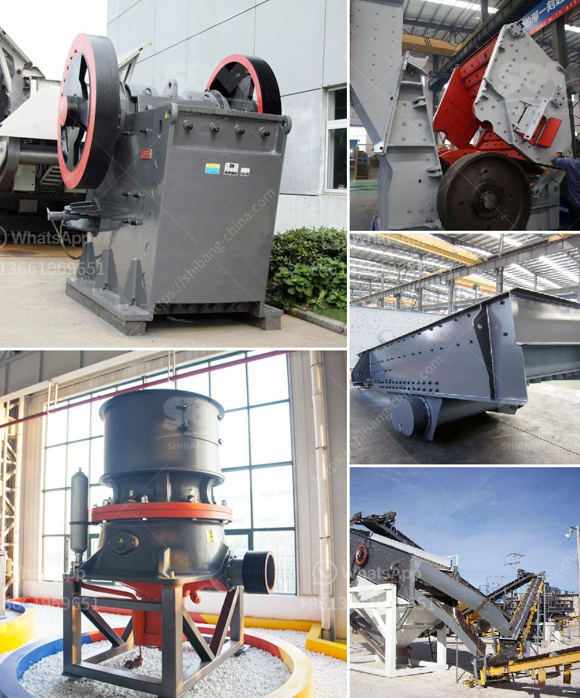

<h3>stone crusher plates in south africa</h3>
Stone crusher plate is a part of the crusher machine that uses two jaw plates to crush materials into pieces. There are a variety of materials used in construction and mining industries that need to be crushed, such as hard rocks, ore, and aggregate. Stone crusher plates are one of the main components that are responsible for crushing the materials.

In South Africa, the mining industry is a big contributor to the country's economic development. Through the mining process, valuable minerals or other geological materials are extracted from the earth. The extracted materials are then processed into various products, such as gold, diamonds, and platinum. Stone crusher plates play a crucial role in this process by reducing the size of the extracted materials, making it easier to handle and transport them.

Stone crusher plates in South Africa are made up of manganese steel, which has high durability and resistance to wear and tear. This material enables the crushers to sustain heavy loads and withstand severe operating conditions. Therefore, stone crusher plates in South Africa directly affect the overall performance of the crushing equipment.

The use of stone crusher plates determines the capacity and efficiency of the crusher machine. When the material is fed into the crushing chamber, it is crushed between the jaw plates. The reciprocating motion of the plates gives a compressive force to the material, reducing it in size. The crushed material then exits through the bottom discharge opening. The size of the discharge opening can be adjusted as per the desired output size.

In South Africa, stone crusher plates are commonly used in static and mobile jaw crushers for the primary crushing of rocks and ores. These plates come in different dimensions and thicknesses to suit various applications. The commonly used stone crusher plates have notches or teeth to grip the material better, ensuring effective crushing.

Apart from their crushing function, stone crusher plates also have a protective role. They prevent the direct contact of rocks and ores with the crusher body, reducing the chances of damage to the machine. Stone crusher plates act as a shield to protect the main body of the crusher from wear and tear caused by continuous operation.

In conclusion, stone crusher plates in South Africa are an essential part of the crushing equipment, contributing to the overall performance of the machine. These plates play a significant role in the reduction of the size of materials, making it easier to process and transport them. With their high durability and resistance to wear and tear, stone crusher plates ensure the efficient and reliable operation of crushers used in the mining industry.
<h3>Contact us</h3><ul><li><strong>Whatsapp:&nbsp;<a href="https://wa.me/8613661969651">+8613661969651</a></strong></li><li><a href="https://swt.shibang-china.com/?git&amp;zhl&amp;stone crusher plates in south africa"><strong>Online Service(chat now)</strong></a></li></ul><h3>Related</h3><ul><li><a href='ton crusher plant price.md'>ton crusher plant price</a></li><li><a href='coal crusher equipment.md'>coal crusher equipment</a></li><li><a href='mineral quartz grinding mills in hyderabad.md'>mineral quartz grinding mills in hyderabad</a></li><li><a href='limestone crusher kenya.md'>limestone crusher kenya</a></li><li><a href='sample of gold mining business plan in ghana.md'>sample of gold mining business plan in ghana</a></li></ul>