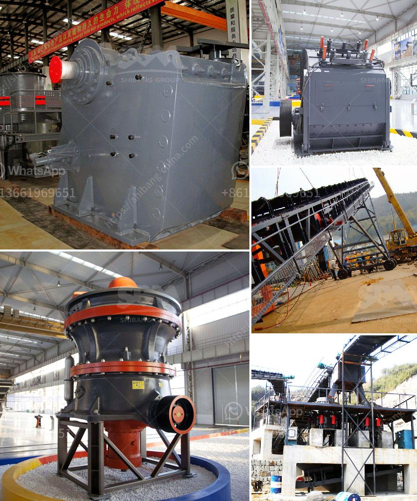

<h3>stone crusher price in zambia</h3>
Stone crusher machine price in Zambia, also called rock crushing plant, is an efficient and reliable equipment for crushing and shaping various stones. This machine combines the characteristics of domestic and foreign models, and is developed and manufactured by the technical personnel of our company according to the market demand. It is the most popular equipment in the current market because it has many advantages such as high crushing ratio, large production capacity, low energy consumption, and uniform product size.

The price of stone crusher in Zambia is affected by several factors, such as quality, design, service experience, etc. China has a large influence on the global stone crusher market. With its high-quality products and advanced production technology, it has become a major stone crusher supplier in the world. In Zambia, China's State Councilor and Foreign Minister, Wang Yi, once stated that China and Zambia are all-weather friends and have shared weal and woe, and that China is willing to work with Zambia to deepen political mutual trust, translate the good relationship into greater practical results, and jointly build the Belt and Road Initiative, so that the friendship between the two countries will bear more fruit.

The stone crusher price in Zambia mainly depends on the size, depth, and processing equipment of the stone mines. However, there are many factors affecting the price of stone crusher in Zambia, including the model, capacity, and the quantity of machines. Based on this condition, we should try to choose the large-scale mining equipment with advanced technology and relatively cheap price. We can also choose the small-scale mining equipment with low price, but we should be careful when buying cheap machines to avoid buying counterfeit and shoddy products, which will not only affect the normal production of the mine but also waste money.

In addition, the price of stone crusher in Zambia is also related to the configuration and installation of the equipment. For example, the jaw crusher or impact crusher with larger processing capacity and higher crushing efficiency has a higher price than the small jaw crusher or impact crusher. Therefore, the investment cost calculations for the stone crusher plant in Zambia are also different.

Stone crusher includes many kinds of crusher machines: jaw crusher, impact crusher, cone crusher, hammer crusher, roller crusher and so on. Generally, cone crusher is more expensive than jaw crusher. However, one kind of crusher includes so many different types and specifications, so their price is hard to say. Before purchasing a stone crusher machine, you should know clearly about the basic condition of the whole mining machinery industry. So the price is relatively low and hence the users can easily afford it. On the contrary, the price of stone crusher is relatively high.

In conclusion, the stone crusher price in Zambia is affected by many factors, including the quality, design, service, etc. Hope that both customers and manufacturers can seize the opportunity, exploit potential market, and gain more profits.
<h3>Contact us</h3><ul><li><strong>Whatsapp:&nbsp;<a href="https://wa.me/8613661969651">+8613661969651</a></strong></li><li><a href="https://swt.shibang-china.com/?git&amp;zhl&amp;stone crusher price in zambia"><strong>Online Service(chat now)</strong></a></li></ul><h3>Related</h3><ul><li><a href='aggregate crushing contract in mexico.md'>aggregate crushing contract in mexico</a></li><li><a href='komatsu crusher in japan for sale.md'>komatsu crusher in japan for sale</a></li><li><a href='iron crusher in mexico.md'>iron crusher in mexico</a></li><li><a href='aggregate screening equipment.md'>aggregate screening equipment</a></li><li><a href='used portable stone crushers for sale ontario.md'>used portable stone crushers for sale ontario</a></li></ul>