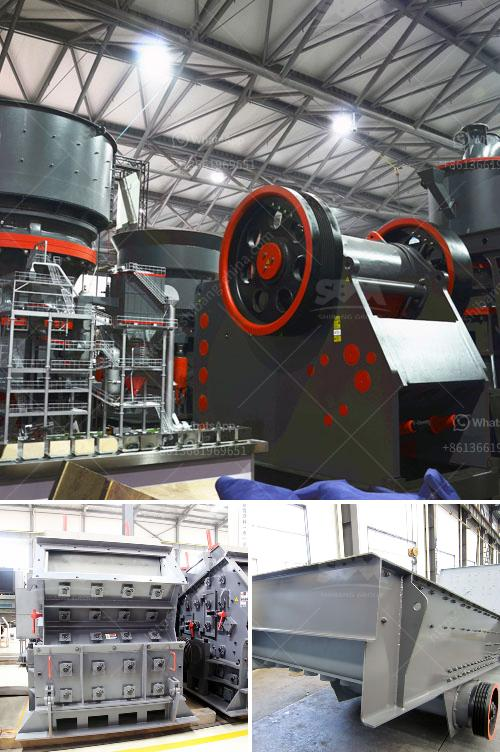

<h3>stone crusher second</h3>
Stone crusher is a machine used to crush rocks into smaller pieces, usually for gravel or some other road or building application. Most of the stone crushers available in the market today have a conical shaft design that provides an optimal crushing angle. This ensures efficient operation of the machine, as well as a higher reduction ratio compared to jaw crushers.

The second type of stone crusher available in the market is known as a cone crusher. These machines are designed to crush stones into smaller pieces according to the desired size. Cone crushers can be used in different stages of the crushing process, depending on the specific needs of the application.

One of the key advantages of a cone crusher is its ability to perform well in various types of applications. Whether it is in mining, quarrying, or recycling, cone crushers can handle a wide range of materials. Additionally, they provide excellent product shape and a high reduction ratio, allowing customers to achieve the desired end product with minimal waste.

In terms of operational efficiency, cone crushers offer several advantages over other types of stone crushers. Firstly, they have a lower energy consumption as compared to jaw crushers. This is due to their high crushing capacity and the unique design of the crushing chamber. The conical shape of the chamber ensures that the stones are effectively crushed, requiring less energy.

Secondly, cone crushers require minimal maintenance. They have fewer moving parts compared to jaw crushers, which means less wear and tear. Additionally, cone crushers are equipped with advanced hydraulic systems that make it easier to adjust the settings and optimize the performance of the crusher. This reduces downtime and ensures a consistent output of high-quality crushed stones.

Furthermore, cone crushers are often equipped with a variety of safety features to protect the operator and the machine. These can include hydraulic overload protection, automatic tramp release systems, and advanced dust suppression systems. These safety features not only improve the overall productivity of the machine but also enhance the overall safety of the working environment.

In conclusion, the second type of stone crusher available in the market, i.e., cone crusher, offers several advantages over traditional jaw crushers. It provides higher reduction ratios, efficient operation, and excellent product shape. Furthermore, it requires minimal maintenance and offers a higher level of operational safety. These factors make cone crushers a preferred choice for various applications in the construction and mining industries.
<h3>Contact us</h3><ul><li><strong>Whatsapp:&nbsp;<a href="https://wa.me/8613661969651">+8613661969651</a></strong></li><li><a href="https://swt.shibang-china.com/?git&amp;zhl&amp;stone crusher second"><strong>Online Service(chat now)</strong></a></li></ul><h3>Related</h3><ul><li><a href='harga mesin molen di medan.md'>harga mesin molen di medan</a></li><li><a href='crushing asphalt with jaw crusher.md'>crushing asphalt with jaw crusher</a></li><li><a href='coal mine wash plants mpumalanga south africa.md'>coal mine wash plants mpumalanga south africa</a></li><li><a href='chrome washing plant in south africa.md'>chrome washing plant in south africa</a></li><li><a href='limestone tons hour machinery.md'>limestone tons hour machinery</a></li></ul>