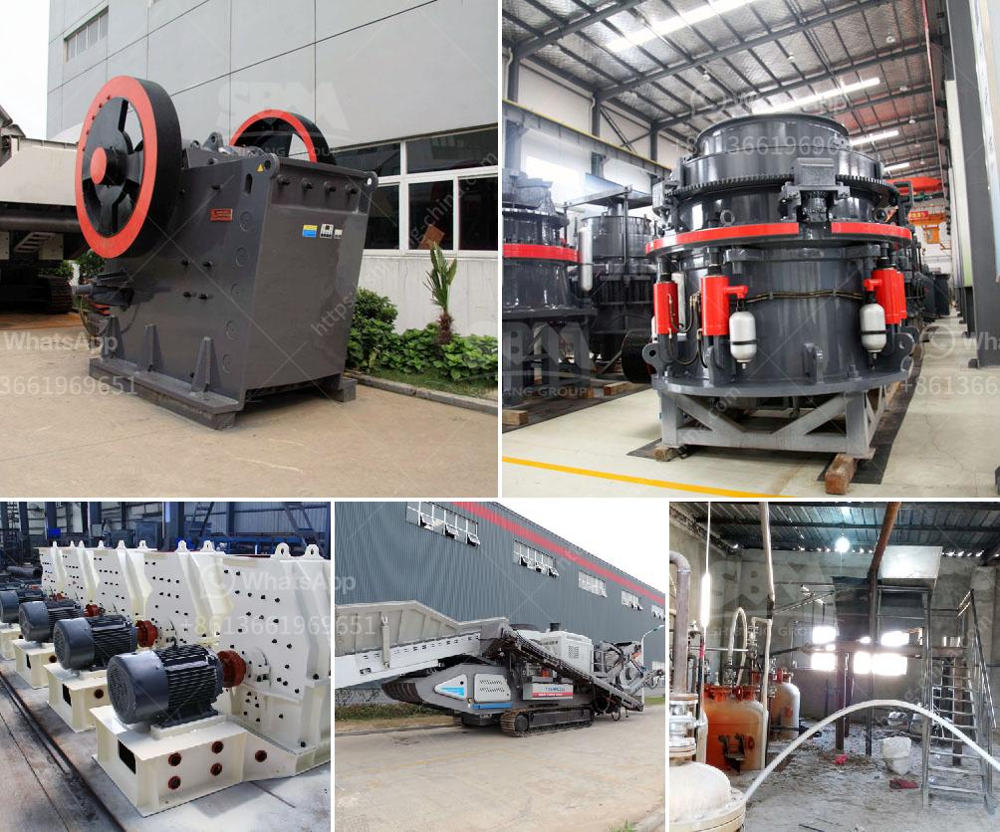

<h3>stone crushers in bennta in bogota</h3>
Located in the mesmerizing city of Bogota, Bennta is home to a thriving industry that continuously contributes to the city's infrastructure development – stone crushers. These powerful machines play a crucial role in the construction sector, transforming large rocks into valuable building materials.

Stone crushers are mechanical devices designed to reduce large rocks into smaller ones. They are commonly used in mining, quarrying, and construction projects. In Bennta, these machines are a common sight, as they work tirelessly to break down rocks and stones, making them suitable for various construction purposes.

One of the primary applications of stone crushers is the production of aggregates. Aggregates are essential building materials that form the backbone of every infrastructure project. From roads and bridges to buildings and railways, stone crushers enable the production of high-quality aggregates in a cost-effective and efficient manner.

The stone crushing process involves two main phases: primary crushing and secondary crushing. During the primary crushing phase, large rocks are fed into the crusher, which breaks them down into smaller pieces. The secondary crushing phase further reduces the size of stones into the desired end product. These stones are then washed, graded, and sorted to create different types of aggregates that meet specific construction requirements.

Stone crushers are equipped with powerful engines and heavy-duty jaws or cones that exert immense pressure on the rocks. The crushing process is aided by mechanisms such as conveyor belts, vibrating screens, and crushers' unique design features to ensure a smooth and continuous operation.

The stone crushers in Bennta not only contribute to the construction industry but also help in the conservation of natural resources. By reusing rocks and stones from excavation sites, these machines reduce the need for quarrying new materials, minimizing environmental impact and cutting down on transportation costs.

In conclusion, stone crushers in Bennta, Bogota are indispensable machines that play a vital role in the construction sector. They efficiently convert large rocks into valuable building materials, supporting the growth and development of the city's infrastructure. With their powerful performance and environmental benefits, stone crushers are a fundamental part of Bogota's ongoing urbanization efforts.
<h3>Contact us</h3><ul><li><strong>Whatsapp:&nbsp;<a href="https://wa.me/8613661969651">+8613661969651</a></strong></li><li><a href="https://swt.shibang-china.com/?git&amp;zhl&amp;stone crushers in bennta in bogota"><strong>Online Service(chat now)</strong></a></li></ul><h3>Related</h3><ul><li><a href='vertical cement mill grinding plant.md'>vertical cement mill grinding plant</a></li><li><a href='powder grinding mill price.md'>powder grinding mill price</a></li><li><a href='power calculation hammer mill equation.md'>power calculation hammer mill equation</a></li><li><a href='mobile coal cone crusher provider malaysia.md'>mobile coal cone crusher provider malaysia</a></li><li><a href='impact jaw crusher.md'>impact jaw crusher</a></li></ul>