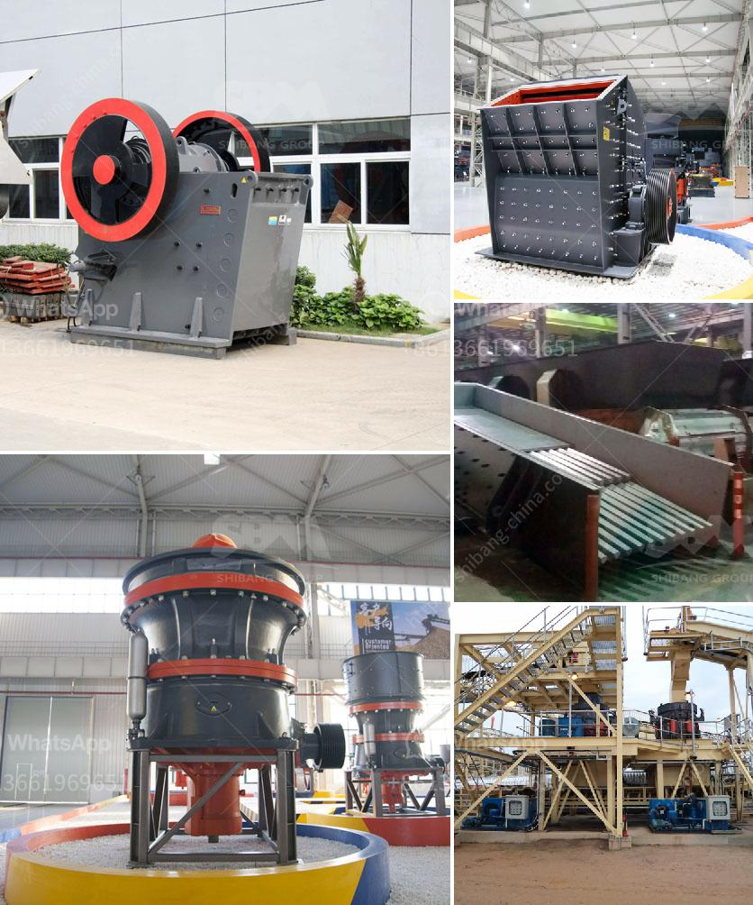

<h3>stone crushers in malaysia</h3>
Stone crushers are heavy-duty machines used to reduce the size of rocks and stones in the construction and mining industries. Stone crushers come in a variety of sizes and models, each designed to produce high-quality aggregates for different applications.

Malaysia is a country with a rich natural heritage and an abundance of resources. The need for stone crushers in Malaysia has been growing rapidly due to the increasing demand for aggregates. To cater to this need, stone crushers are increasingly being imported from countries like China to meet the growing demand.

Stone crushers are commonly used for crushing various stones and rocks, such as granite, limestone, basalt, gravel, pebble, etc. The materials to be crushed can be hard, medium-hard, and soft minerals whose compressive strength should be not more than 320 MPa. Our stone crushers machine is suitable for primary, secondary, and tertiary crushing.

Cone crushers mainly divide into GP, HP, and Symons series, compound, CS, HPC, sand, laboratory, propel cone, etc. Since the compound cone crusher has finer discharging, it is r e ´ g´ n ´ -arded as a necessary equipment for the last process in the stone industry, highway, and construction fields.

With the development of the people's living standards, competitiveness, and social consciousness, stone crushers should be more environmentally friendly. STC Stone crushers are essential in mining, road construction, reservoir, and bridge intallations.

Indeed, many economists believe that with the continuous development of economic systems in Malaysia, the need for stone crushers will continue to grow at an alarming rate. This will require more advanced and reliable stone crushing machines to service the needs of both local and international markets.

One of the most notable companies expanding into the Malaysian stone crushing industry is Crusher. Crusher is a leading manufacturer of rock crushing machines around the world. Its products have been used in various industries, such as mining, road construction, metallurgy, shipbuilding, and engineering industries.

Crusher machines are designed to produce high-quality aggregates, which are crucial in many construction projects. The machines are equipped with advanced technology to ensure efficient and precise crushing of stones. Moreover, the machines are built to be highly durable, reducing maintenance costs and ensuring smooth operations.

In conclusion, stone crushers are essential machines in the construction and mining industries. In Malaysia, stone crushers are imported from China to meet the growing demand for aggregates. With the continuous development of Malaysia's economy, the need for stone crushers is increasing. Crusher is a leading manufacturer of rock crushing machines globally. Their machines are highly efficient, durable, and designed to produce high-quality aggregates. With their advanced technology, they are able to meet the demands of the Malaysian stone crushing industry effectively.
<h3>Contact us</h3><ul><li><strong>Whatsapp:&nbsp;<a href="https://wa.me/8613661969651">+8613661969651</a></strong></li><li><a href="https://swt.shibang-china.com/?git&amp;zhl&amp;stone crushers in malaysia"><strong>Online Service(chat now)</strong></a></li></ul><h3>Related</h3><ul><li><a href='chromite ore crushing machine.md'>chromite ore crushing machine</a></li><li><a href='calcite and dolomite plant process.md'>calcite and dolomite plant process</a></li><li><a href='crusher plant in jizan saudi arabia.md'>crusher plant in jizan saudi arabia</a></li><li><a href='mobile crusher datasheet.md'>mobile crusher datasheet</a></li><li><a href='stone quarries in mpumalanga.md'>stone quarries in mpumalanga</a></li></ul>