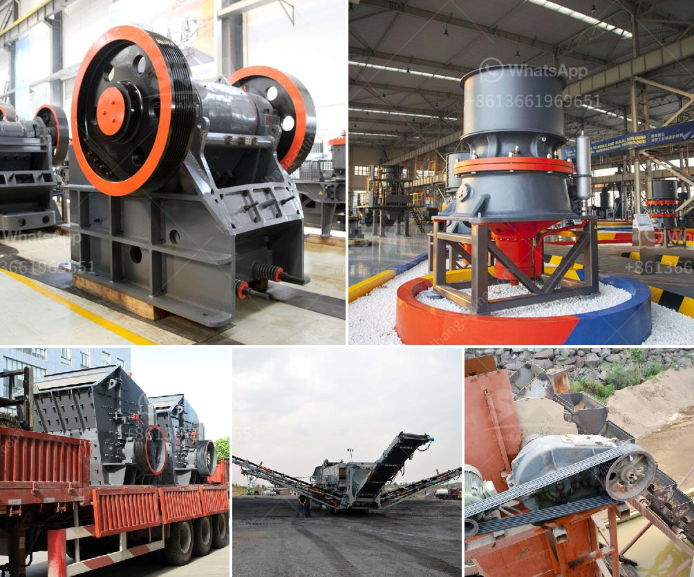

<h3>stone crushing business in zimbabwe</h3>
Stone crushing industry is a crucial industrial sector in Zimbabwe. The crushed stone is used as crude material for different development activities. It is the natural resources and used for the constructions of residential and commercial buildings, streets, bridges, canals, flyovers and other infrastructure projects.

Stone Crushing Industry is an important industrial sector engaged in producing crushed stone of various sizes depending upon the requirement, which acts as raw material for various construction activities such as construction of Roads, Highways, Bridges, Buildings, Canals etc. It is estimated that there are over 12,000 stone crushing units in Zimbabwe.

The main machinery involved in the stone crushing industry is hammer crusher, jaw crusher, impact crusher, cone crusher, screening machine, belt conveyors etc. The crushing process is generally operated in three stages according to final materials uses, including primary crushing, secondary crushing and tertiary crushing.

To establish a stone crusher plant, you need to identify a suitable area for the crushing operations. Initially, this involves several questions regarding the machinery, permits, money, and the overseeing of the entire operations.

Typically, stone crushing plants undergo a tertiary procedure of creating different kinds of aggregate material. Initially, you will start out with a jaw crusher, and also this is made for larger course or medium types of minerals.

Moreover, stone crushing plants in Zimbabwe have also gained importance due to the increased employment opportunities provided by the sector. For instance, the Government of Zimbabwe has initiated a road development program targeting rural areas under the National Rural Road Development Program. The program is expected to provide employment opportunities for many youths in various communities across the country.

Although it is an important sector, stone crushing industry is also associated with a number of environmental issues. Some of the major environmental concerns include noise pollution caused by the use of heavy machinery, stone dust pollution, uncontrolled disposal of effluents, and damage to agricultural lands.

Due to these issues, most stone crushing units are located in close proximity to residential areas. This not only causes health hazards for the residents but also distracts agricultural activities. In order to mitigate these issues, some measures can be taken such as planting trees around the crushing units to act as a barrier against noise and dust pollution.

In conclusion, stone crushing industry is a thriving business and requires the right equipment to thrive in this industry. The stone crushing equipment mainly includes jaw crusher, impact crusher, cone crusher, mobile crusher, and various other types of crushing equipment, each type of crusher has a different model to meet the various production needs. Investing in a stone crusher plant can be very lucrative for any stone crushing business. With the industry picking up, this is a great time to invest in a stone crusher plant.
<h3>Contact us</h3><ul><li><strong>Whatsapp:&nbsp;<a href="https://wa.me/8613661969651">+8613661969651</a></strong></li><li><a href="https://swt.shibang-china.com/?git&amp;zhl&amp;stone crushing business in zimbabwe"><strong>Online Service(chat now)</strong></a></li></ul><h3>Related</h3><ul><li><a href='river sand suppliers in northern cape.md'>river sand suppliers in northern cape</a></li><li><a href='crusher plant project cost.md'>crusher plant project cost</a></li><li><a href='contact address puzzolana cone crusher.md'>contact address puzzolana cone crusher</a></li><li><a href='ball mills for rent.md'>ball mills for rent</a></li><li><a href='stone crusher plant price.md'>stone crusher plant price</a></li></ul>