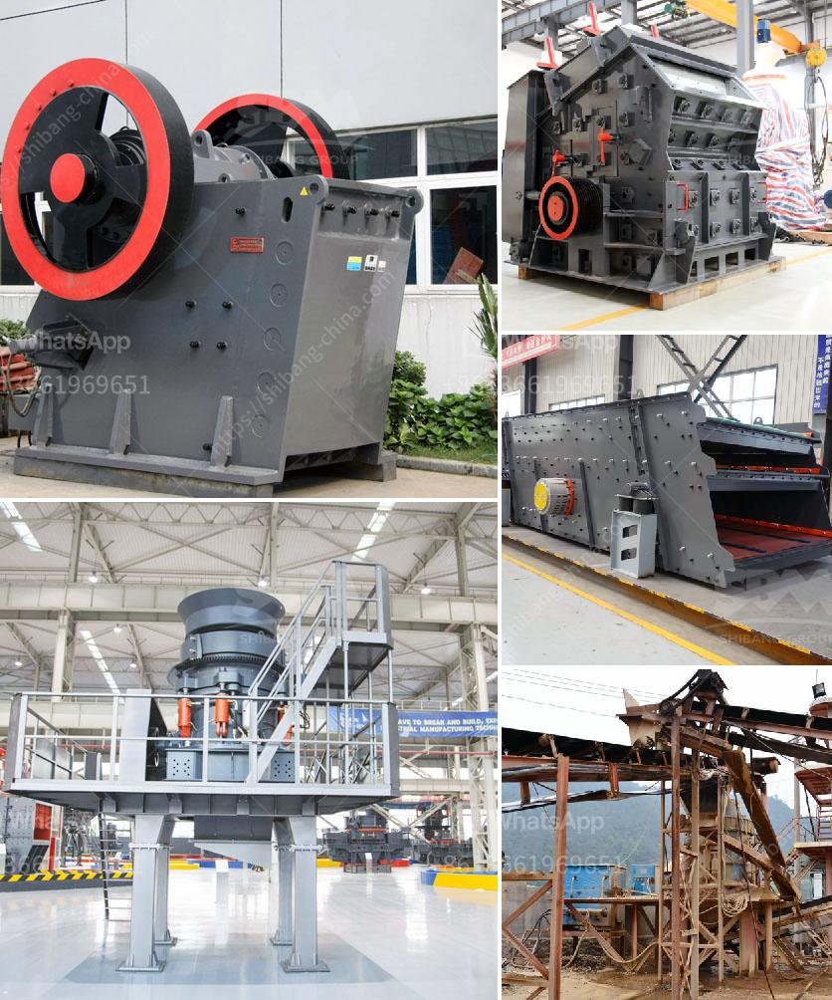

<h3>stone crushing contractors california</h3>
Stone crushing contractors California are a growing industry that provides services to various construction sectors, including highways, buildings, and bridges. With the increasing demand for aggregates, contractors specializing in stone crushing are seeing high levels of activity in the local market.

Stone crushing contractors are responsible for processing raw materials into aggregate materials that can be used in the construction industry. This involves breaking down large rocks and stones into smaller pieces using heavy machinery like crushers, grinders, and screens. The resulting materials are then used in concrete production, road base, and other construction applications.

California is a state known for its vibrant construction sector, with numerous ongoing and upcoming infrastructure projects. As a result, stone crushing contractors play a crucial role in supplying the necessary building materials. They work closely with construction companies, government agencies, and private developers to provide the aggregates needed for the successful completion of these projects.

Stone crushing contractors California also focus on environmental sustainability. Crushing and processing raw materials can have environmental impacts, but contractors implement measures to minimize these effects. These may include using dust control systems, water sprays, and proper waste management practices to ensure that the process is carried out responsibly.

Furthermore, stone crushing contractors California adhere to industry standards and regulations. They maintain proper licenses and permits required by local authorities, ensuring that their operations are legal and safe. Additionally, contractors prioritize the health and safety of their employees by providing proper training, personal protective equipment, and maintaining a safe working environment.

In conclusion, stone crushing contractors in California play a crucial role in supplying necessary building materials to the construction industry. They employ heavy machinery and adhere to environmental and safety regulations to ensure responsible operations. With the growing demand for aggregates, these contractors are expected to continue servicing the construction sector and contribute to the state's infrastructure development.
<h3>Contact us</h3><ul><li><strong>Whatsapp:&nbsp;<a href="https://wa.me/8613661969651">+8613661969651</a></strong></li><li><a href="https://swt.shibang-china.com/?git&amp;zhl&amp;stone crushing contractors california"><strong>Online Service(chat now)</strong></a></li></ul><h3>Related</h3><ul><li><a href='beast crusher price.md'>beast crusher price</a></li><li><a href='silica sand grinding machine.md'>silica sand grinding machine</a></li><li><a href='gold mining processing plant in canada.md'>gold mining processing plant in canada</a></li><li><a href='list iron ore pellet plants in india.md'>list iron ore pellet plants in india</a></li><li><a href='calcium carbonate machine.md'>calcium carbonate machine</a></li></ul>