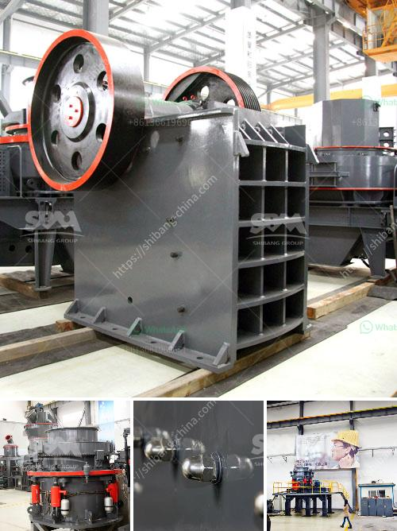

<h3>stone crushing machine for sale</h3>
Stone crushing machine is the important equipment which widely used in metallurgy, mine, chemical industry, electric power, ceramics, cement, construction and road building industries. Along with the India economic level rising, the government has paid more and more attention to the construction projects. And as the professional manufacturer of mining machinery, such as stone crushing machine for sale, has provided customers with equipment of high quality and low price. 

Stone crushing machines can be used for crushing various stones. With the increasing demand of construction aggregate, more and more rocks need to be crushed for different applications. Pebbles, granite, basalt, limestone, quartz stone and other materials are commonly used for crushing operations. The stone crushing machine is powered by an electric motor or a diesel engine, and drives the rotor of the machine through the belt pulley or coupling. Therefore, the rotor rotates with high speed to crush the stones according to the use of different crushers.

Compared with traditional stone crushing machines, the new generation of portable stone crushing machine has been greatly improved in terms of internal structure, installation, operation, environmental protection design and other aspects, and is loved by the majority of users in many industries. 

The stone crushing machine for sale includes PE jaw crusher, PF impact crusher, PY cone crusher, PC hammer crusher and HPT cone crusher, etc. The main characteristics of the stone crushing machine are: large crushing ratio, high production capacity, simple structure, easy maintenance, etc. Especially for the medium-hard and hard materials, it has a significant advantage.

Firstly, the PE jaw crusher has a more reasonable design for the deep cavity crushing chamber, which ensures the smooth feeding and discharging of the materials, improves the production efficiency, and ensures the uniformity of the finished product size. Secondly, the PF impact crusher adopts the advanced wear-resistant materials, which greatly improve the service life of the wearing parts and reduce the replacement frequency, saving a lot of maintenance costs for the user. Thirdly, the PY cone crusher has a high degree of automation, which can help users save a lot of manpower and material resources while ensuring the stable operation of the machine.

In summary, stone crushing machines have a wide range of applications, high production efficiency, and good crushing effect. When purchasing a stone crushing machine, it is important to choose a reputable manufacturer and ensure the quality of the equipment. At the same time, users should also consider their own actual needs and production capacity to select the appropriate model. With the continuous development of technology, stone crushing machines will also have greater breakthroughs, bringing more convenience and benefits to users.
<h3>Contact us</h3><ul><li><strong>Whatsapp:&nbsp;<a href="https://wa.me/8613661969651">+8613661969651</a></strong></li><li><a href="https://swt.shibang-china.com/?git&amp;zhl&amp;stone crushing machine for sale"><strong>Online Service(chat now)</strong></a></li></ul><h3>Related</h3><ul><li><a href='gypsum crushing machines.md'>gypsum crushing machines</a></li><li><a href='cement making machinery for whole cement plant.md'>cement making machinery for whole cement plant</a></li><li><a href='iron crushing equipment price.md'>iron crushing equipment price</a></li><li><a href='coal mill price 5 tph.md'>coal mill price 5 tph</a></li><li><a href='100tph wet grinding mill.md'>100tph wet grinding mill</a></li></ul>