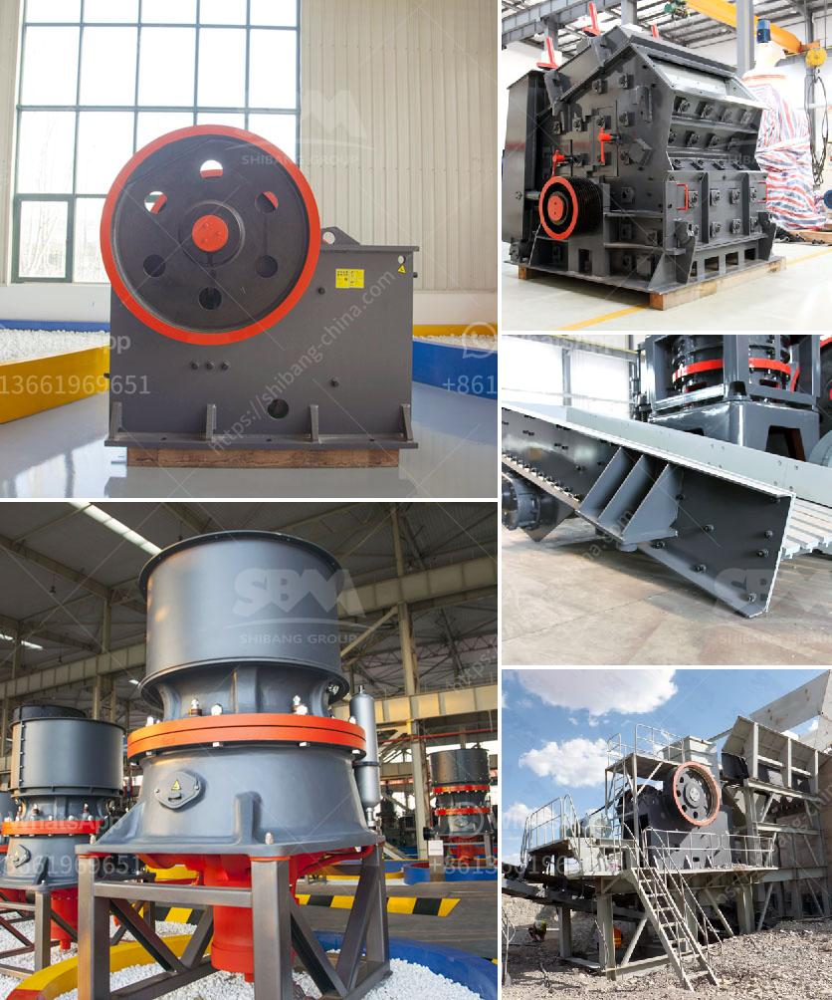

<h3>stone crushing machine in dubai</h3>
Stone crushing machine is primarily used for reducing the size of stones or rocks in order to facilitate easier handling or for recycling purposes. The machine is capable of crushing stones up to 500mm in diameter, for services in construction and maintenance of roads, bridges, and highways.

Stone crushers are vital equipment used in rock crushing operations around the world. There are various types of stone crushers including jaw crushers, impact crushers, cone crushers, hammer crushers, vertical shaft impact crushers, and so on. These different types have different characteristics and capabilities, making them suitable for different crushing tasks.

In Dubai, stone crusher is used for crushing Sandstone, Limestone, Granite, Dolomite, Gypsum, and Quartzite, etc. There are many suppliers of stone crushing machines in Dubai. The Global Stone Crushing Equipment Market report offers key insights into the global market research industry and details the emerging trends, drivers, restraints, and opportunities in the market.

The stone crushing machines are available in various sizes, ranging from 300mm to 500mm in diameter and varying capacities depending on the specific requirements of the application. These machines are designed using high-quality materials and advanced technology to ensure high efficiency and superior performance.

One of the primary advantages of stone crushing machines is their versatility. These machines can be used in various industries such as mining, metallurgy, building materials, highways, railways, water conservancy, and chemical industries. They can handle a wide range of materials, including copper ore, limestone, basalt, granite, marble, iron ore, and more.

The stone crushing machines in Dubai are also equipped with advanced safety features to ensure the workers' safety. All the machines incorporate robust construction and engineering concepts designed to withstand the toughest conditions while delivering excellent performance. They are also energy-efficient, reducing energy consumption and minimizing environmental impact.

Another key advantage of stone crushing machines in Dubai is the ease of maintenance. These machines have simple structures, making them easy to operate and maintain. They are also designed for easy access to the internal components, ensuring quick and hassle-free maintenance and repairs.

Stone crushing machines in Dubai are widely used in the construction industry for processing materials such as rocks, stones, gravel, and sand. The stone crushing machines are used to crush large-sized rocks into smaller pieces to facilitate transportation or for further processing in a rock processing plant.

In recent years, the UAE government has taken various initiatives to promote the development of the construction industry and improve infrastructure. This has boosted the demand for stone crushing machines, leading to a thriving market in Dubai.

In conclusion, stone crushing machines in Dubai are in high demand, and the market is expected to grow significantly in the coming years. The stone crushing machines are versatile and can be used in various industries such as mining, construction, and infrastructure development. The machines are designed to deliver high performance, efficiency, and durability. With advanced safety features and easy maintenance, they are an ideal choice for stone crushing applications in Dubai.
<h3>Contact us</h3><ul><li><strong>Whatsapp:&nbsp;<a href="https://wa.me/8613661969651">+8613661969651</a></strong></li><li><a href="https://swt.shibang-china.com/?git&amp;zhl&amp;stone crushing machine in dubai"><strong>Online Service(chat now)</strong></a></li></ul><h3>Related</h3><ul><li><a href='production process clinker zurich switzerland.md'>production process clinker zurich switzerland</a></li><li><a href='cost of bentonite manufacturing processing plant.md'>cost of bentonite manufacturing processing plant</a></li><li><a href='quotation for iron ore processing.md'>quotation for iron ore processing</a></li><li><a href='gypsum powder factory feasibility study.md'>gypsum powder factory feasibility study</a></li><li><a href='stone crushers in malaysia.md'>stone crushers in malaysia</a></li></ul>