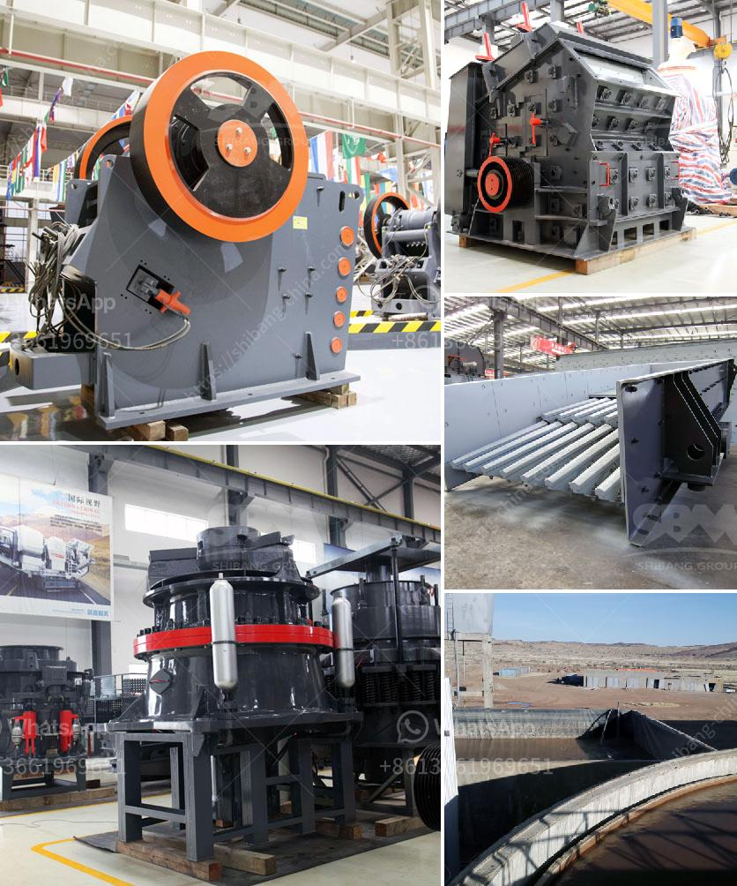

<h3>stone crushing machine price in india</h3>
Stone Crushing Machine Price in India is a crucial factor for customers to choose the most suitable crushing machine for their processing needs. As a well-established and reliable crushing machine manufacturer in India, we offer a wide range of machines such as jaw crusher, impact crusher, cone crusher, hammer crusher, and so on. These machines are of superior quality and provide excellent crushing performance. In addition, the price of stone crushing machine in India is also relatively competitive, so customers can choose the most cost-effective option.

The demand for stone crushing machines is increasing day by day in India. The number of construction projects is on the rise, and the demand for crushed stones and other materials is also increasing rapidly. Therefore, the crushing industry in India is booming and professionals in the field can expect lucrative job opportunities. However, to meet the growing demand, it is necessary to have efficient and reliable crushing machines that can produce high-quality aggregates.

The price of stone crushing machines in India depends on a lot of factors, such as production capacity, type of machine, brand, raw materials used, and machine maintenance. Generally, the prices of stone crushing machines are relatively low in India compared to other countries. However, customers should do a detailed research and choose a reliable manufacturer to ensure the quality and effectiveness of the machine.

One of the factors that affect the price of stone crushing machine in India is the availability of raw materials. Indian limestone reserves are estimated to be around 200 billion tons, and the majority of these reserves are found in the states of Andhra Pradesh, Rajasthan, Karnataka, and Madhya Pradesh. These states are home to a large number of stone quarries, which provide a steady supply of raw materials for stone crushing machine manufacturers. As a result, the cost of raw materials for crushing machines is relatively low in India, which helps keep the price of machines low.

Another factor that influences the price of stone crushing machines in India is the transportation cost. Stone crushing machines need to be transported to remote areas for crushing purposes. Therefore, the transportation cost becomes a significant factor for customers to consider. In India, the transportation cost is relatively affordable due to a well-developed transportation network. The availability of affordable transportation facilities enables manufacturers to keep the prices of stone crushing machines reasonable.

In conclusion, the price of stone crushing machines in India is relatively low compared to other countries due to the availability of raw materials and affordable transportation facilities. Therefore, customers can choose the most suitable crushing machine at a reasonable price. However, it is essential to do proper research and choose a reliable manufacturer to ensure the quality and efficiency of the machine. With the booming construction industry in India, there is a huge demand for high-quality aggregates, and stone crushing machines play a crucial role in meeting this demand.
<h3>Contact us</h3><ul><li><strong>Whatsapp:&nbsp;<a href="https://wa.me/8613661969651">+8613661969651</a></strong></li><li><a href="https://swt.shibang-china.com/?git&amp;zhl&amp;stone crushing machine price in india"><strong>Online Service(chat now)</strong></a></li></ul><h3>Related</h3><ul><li><a href='used stone crusher for sale in usa.md'>used stone crusher for sale in usa</a></li><li><a href='calcium carbonate in kenya.md'>calcium carbonate in kenya</a></li><li><a href='stone jaw crusher for rock crushing.md'>stone jaw crusher for rock crushing</a></li><li><a href='ball mills for mining technical drawing.md'>ball mills for mining technical drawing</a></li><li><a href='how to build a small rock crusher.md'>how to build a small rock crusher</a></li></ul>