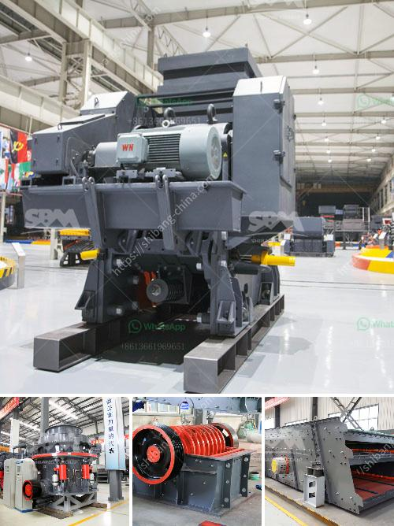

<h3>stone crushing plant manufacturer</h3>
Stone crushing plant is one-stop crushing installation, which can be used for rock crushing, garbage crushing, building materials crushing and other similar operations. Crushing plants may be either fixed or mobile, depending on the requirements. The crushing plant can be combined into coarse crushing system and fine crushing system according to customers' actual needs, it can also be combined into three stages: coarse crushing, crushing and fine crushing.

As a professional stone crusher plant equipment manufacturer, Fote Heavy Machinery insists on providing customers with high quality crushing equipment with comprehensive technical support. A good stone crushing plant manufacturers must have a strong technology and rich experience in the industry. Founded in 1982, we have accumulated nearly 40 years' experience in stone crushing plant and related machines.

After more than four decades of continuous innovation and development, we have become one of the leading stone crushing plant manufacturers in China. Our stone crushing plants are widely used in mining, road construction, building materials, highways, railways, chemical and other industries.

There are several reasons why our stone crushing plants have a higher performance and efficiency compared to competitors. First, we have a strong team of engineers who are committed to designing the most suitable stone crushing plant based on customers' requirements and actual conditions. Our engineers will consider various factors, such as crushing capacity, raw materials, output size, feed size, site conditions and so on. They will provide professional suggestions and choose the best crushing configuration for customers.

Second, our stone crushing plant is equipped with advanced technology and electrical control system. The whole production line adopts high-efficiency and low-consumption equipment, producing less noise and less pollution. The stone crushing plant is also equipped with dust and noise reduction devices, which allows the production process to run smoothly and effectively.

Third, our stone crushing plants are equipped with various crushing equipment, such as jaw crusher, impact crusher, cone crusher and vertical shaft impact crusher, etc. Each machine has different model and specifications, suitable for different production capacity and particle size requirements. Customers can choose the most suitable equipment according to their actual needs.

Fourth, our stone crushing plants are equipped with screening equipment, which can screen and separate the crushed stone into different sizes. The screening equipment has high screening efficiency and long service life, reducing the production cost and improving the final product quality.

In conclusion, as a professional stone crushing plant manufacturer, Fote Heavy Machinery has a wealth of experience and strong technical support. Our stone crushing plants are reliable in quality and competitive in price. Whether you are planning to set up a small stone crushing plant or large-scale crushing production line, we will provide the most suitable solution for you. Just contact us and let us know your requirements, we will offer you the best stone crushing plant and service.
<h3>Contact us</h3><ul><li><strong>Whatsapp:&nbsp;<a href="https://wa.me/8613661969651">+8613661969651</a></strong></li><li><a href="https://swt.shibang-china.com/?git&amp;zhl&amp;stone crushing plant manufacturer"><strong>Online Service(chat now)</strong></a></li></ul><h3>Related</h3><ul><li><a href='ball miling for lime stone.md'>ball miling for lime stone</a></li><li><a href='stone crosser companys at india.md'>stone crosser companys at india</a></li><li><a href='mobile stone crushing plants price.md'>mobile stone crushing plants price</a></li><li><a href='how to create a proposal for quarry factory.md'>how to create a proposal for quarry factory</a></li><li><a href='barite mill crusher.md'>barite mill crusher</a></li></ul>