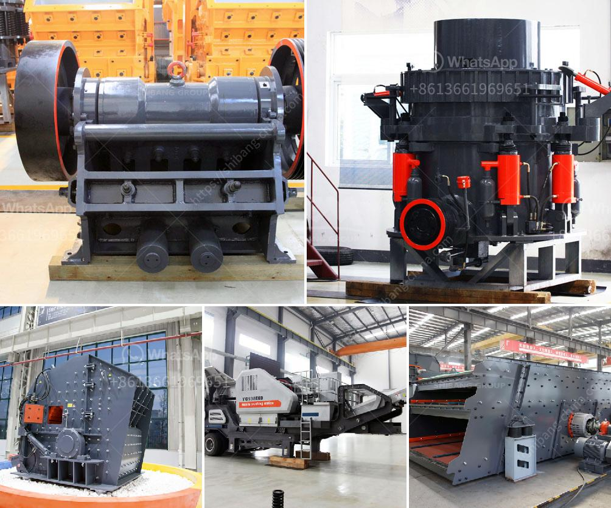

<h3>stone crushing plant manufacturers</h3>
Stone crushing plant is the most important equipment in stone industry and mining industry, which is used for primary crushing of stones or big rock into smaller particles. Different types of machines are used for crushing stones into smaller pieces with the same level of productivity.

Stone crushing plants are often used for crushing large stones into smaller particles or to produce aggregates for construction or sale in the market. In some cases, the crushed stones are used as raw materials for further processing in the industrial sector. The stone crushing plant manufacturers design and develop stone crusher machines and equipment to provide high quality products for our customers.

The stone crushing plant manufacturers have abundant production experience with advanced technical level. The main advantages of the crusher machine are high productivity and low maintenance. There are so many types of stone crushers, such as jaw crusher, cone crusher, impact crusher, mobile crushing plant, etc.

As the leading stone crusher machine manufacturer in China, we will provide maximum preferential factory price and discount for you. Our stone crusher has been exported to South Africa, Kenya, Nigeria, Ethiopia, Zambia, Namibia, Somalia, Nepal, Pakistan, Philippines, Malaysia, Saudi Arabic and over 90 countries around the world.

The market demand for stone crushing plant manufacturers in recent years is increasing rapidly due to the continuous expansion of the construction industry. Stone crushing plants are essential equipment for mining and stone crushing. With the increasing need for stone crusher plants, leading manufacturers in this industry are continuously striving to improve the production technology to meet the market demand.

The stone crushing plant manufacturers not only provide high quality products, but also offer professional consultation services as well as complete after-sales support. With the help of our experienced and skilled professionals, we are able to deliver products within the promised time frame. We also offer various designs for customers to choose from according to their specific requirements.

In addition to quality products and competitive prices, stone crushing plant manufacturers also ensure timely delivery of products to meet customer demands. They have a strong production capacity and can efficiently cater to the demands of various industries. Each crushing plant is designed and manufactured with precision to ensure optimum performance and durability.

The stone crushing plant manufacturers have a wide range of machines and equipment to choose from, such as jaw crusher, cone crusher, impact crusher, vibrating feeder, vibrating screen and belt conveyor. All these machines are designed and manufactured by experienced engineers and technicians to provide high quality products.

In conclusion, stone crushing plant manufacturers play a vital role in the construction industry and mining industry. Their high quality products and efficient production capabilities help in meeting the demands of customers. With continuous innovation and development, stone crushing plant manufacturers are able to provide advanced and reliable equipment to enhance productivity and improve the overall efficiency of the stone crushing process.
<h3>Contact us</h3><ul><li><strong>Whatsapp:&nbsp;<a href="https://wa.me/8613661969651">+8613661969651</a></strong></li><li><a href="https://swt.shibang-china.com/?git&amp;zhl&amp;stone crushing plant manufacturers"><strong>Online Service(chat now)</strong></a></li></ul><h3>Related</h3><ul><li><a href='marble mining equipment.md'>marble mining equipment</a></li><li><a href='price of quarry crusher in zimbabwe.md'>price of quarry crusher in zimbabwe</a></li><li><a href='stone crosser companys at india.md'>stone crosser companys at india</a></li><li><a href='stone crusher machine price kenya.md'>stone crusher machine price kenya</a></li><li><a href='conveyor belt kazakhstan.md'>conveyor belt kazakhstan</a></li></ul>