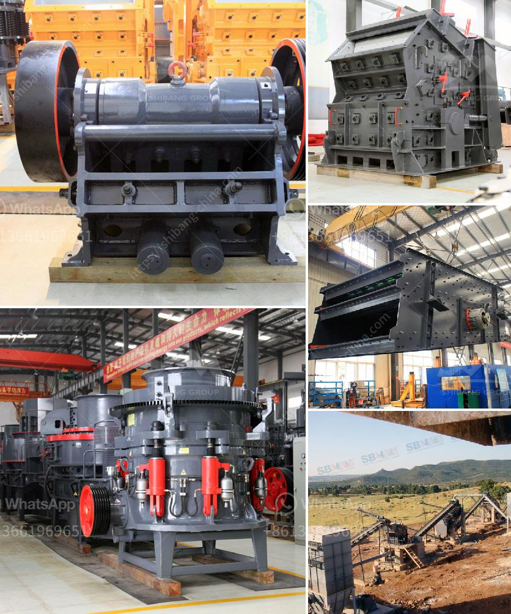

<h3>stone crushing plant price list</h3>
Stone crushing plant is a specialized production line aimed to produce building sand and stone, saving 50% energy than traditional stone production line. It enables the rock, sand and gravel, cobble and other materials to be made into various granularities conformed to the requirements of building sand. Undoubtedly, the stone crushing plant price list plays an important role in the purchasing process of the customers.

As a professional crusher exporter, Aimix’s stone crusher design has many excellent features compared with ordinary crusher. 1. The limestone grinding machine not only has fine crushing and coarse grinding function, but also has high crushing efficiency; 2. Aimix’s stone crusher unit has simple structure, easy installation and maintenance, low operation cost, and so on; 3. The finished product has excellent grain shape. And these finished products are very suitable for road construction, building construction, bridge construction and so on.

Last but not least, the wear parts of the stone crusher are made of high-quality wear-resistant materials, which greatly extends the service life of the equipment. Moreover, the manufacturer has a mature technology and advanced design, steering a promising future. Having rich experience of more than 30 years, Aimix Group is a reliable stone crusher supplier. If you are interested in our equipment, please leave your message down below. We will get back to you as soon as possible.

The stone crusher price list crushing plant consist of a vibrating feeder, primary crusher, secondary crusher, tertiary crusher, screen and belt conveyor. Although crushing plants have different models, all of them achieve the same crushing objectives. These crushers come with high power and efficiency, reducing size of raw material. Meaning, crushing plant comes with small portable features, making it highly flexible and efficient.

The mobile crushers are characterized by low cost to operate and maintain. By using the most advanced technology, Aimix’s crushing plant can achieve high productivity and high reduction ratio. The mobile crushers can produce high-quality end products, no matter what the demands are. Ample and flexible stone crusher price list give customers sizable returns.

For the construction industry, a stone crushing plant is an excellent equipment to provide qualified materials for highway, railway, and building projects. Customers can purchase as many models and specifications as they want. If you have any questions, please do not hesitate to contact us. We are always looking forward to your enquiry.

In conclusion, a stone crushing plant price list is an essential piece of information to evaluate whether it is within budget or not. However, buying from a reputable manufacturer, such as Aimix Group, ensures that customers will enjoy the best service and reasonable price. Thus, if you are looking for a stone crushing plant, please feel free to contact us. Aimix will provide you with personalized solutions.
<h3>Contact us</h3><ul><li><strong>Whatsapp:&nbsp;<a href="https://wa.me/8613661969651">+8613661969651</a></strong></li><li><a href="https://swt.shibang-china.com/?git&amp;zhl&amp;stone crushing plant price list"><strong>Online Service(chat now)</strong></a></li></ul><h3>Related</h3><ul><li><a href='cost estimate ball mill.md'>cost estimate ball mill</a></li><li><a href='crushing machine 500 tons per hour size.md'>crushing machine 500 tons per hour size</a></li><li><a href='talc processing plant.md'>talc processing plant</a></li><li><a href='vertical spindle roller mill.md'>vertical spindle roller mill</a></li><li><a href='calcium carbonate plant layout diagram.md'>calcium carbonate plant layout diagram</a></li></ul>