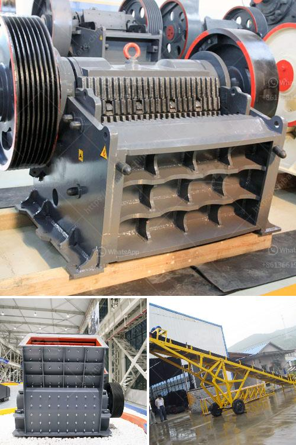

<h3>stone crushing production line</h3>
Stone crushing production line, also known as stone crushing plant, refers to the complete set of equipment used to produce stones with all kinds of particle sizes. In recent years, it has become more and more important as a production line in the construction industry.

The development of stone crushing production line is the key factor to ensure the construction quality and enhance the market competition. The stone crushing production line is mainly composed of vibrating feeder, jaw crusher, impact crusher, vibrating screen, belt conveyor and centralized electric control equipment. The designed output is generally 50-800t/h, in order to meet the different processing needs of customers.

It can be equipped with cone crusher, dust removal equipment and other equipment to form a complete stone crushing production line. The investment cost of the equipment is relatively high, but the production cost is low and the output is high. It has made remarkable achievements in the field of construction waste crushing, mining, and gravel processing.

The stone crushing production line has a high degree of automation, large crushing ratio, high production efficiency, and large processing capacity. The broken product has a cubic shape, low needle-like content, no internal cracks, and high compressive strength. The equipment is suitable for medium and fine crushing of various ores and rocks, with high hardness and high abrasion resistance.

Stone crushing production line is mainly used in quarries, gravel yards, mining, coal mining, concrete mixing stations, and other fields. There are different production lines depending on the hardness of the raw materials, ranging from 100-300t/h to 500-600t/h. The complete set of equipment includes heavy hammer crusher, bucket elevator, vibrating feeder, circular vibrating screen, and belt conveyor, etc.,

In conclusion, the stone crushing production line is becoming more and more important as a production line in the construction industry, with a high degree of automation, high crushing efficiency, large capacity, and cost-effective investment. It has gained popularity among customers and has become a necessary and important equipment in construction projects.
<h3>Contact us</h3><ul><li><strong>Whatsapp:&nbsp;<a href="https://wa.me/8613661969651">+8613661969651</a></strong></li><li><a href="https://swt.shibang-china.com/?git&amp;zhl&amp;stone crushing production line"><strong>Online Service(chat now)</strong></a></li></ul><h3>Related</h3><ul><li><a href='graphite mine slurry ball mill.md'>graphite mine slurry ball mill</a></li><li><a href='harga pe jc jaw crusher dan harga.md'>harga pe jc jaw crusher dan harga</a></li><li><a href='rock crushers in south africa.md'>rock crushers in south africa</a></li><li><a href='quarry crusher for sale in ghana.md'>quarry crusher for sale in ghana</a></li><li><a href='how much would it cost to start a gravel quarry.md'>how much would it cost to start a gravel quarry</a></li></ul>