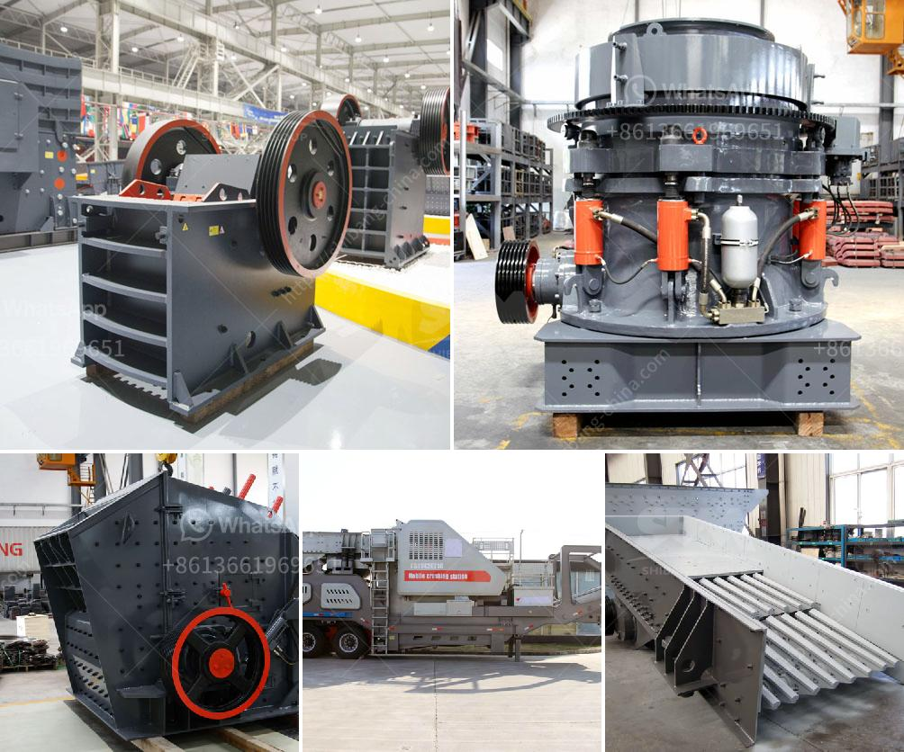

<h3>stone crussing machines in pakistan</h3>
Stone crushing machines are a major part of the construction industry in Pakistan. The technology and equipment used in the crushing process are critical for the productive and efficient production of stones of various sizes and shapes.

Stone crushing is an activity that requires a machine to break the large stones into smaller particles. Crushers are machines designed to reduce large rocks into smaller rocks, gravel, or rock dust. Crushing machines are widely used in mining, metallurgy, construction, highways, railways, water conservancy, and chemical industries.

In Pakistan, stone crushing machines have been a significant contributor to the industrial sector and the development of Pakistan. Pakistan is home to many types of minerals, some of which make it prominent in the mineral world, such as peridot, aquamarine, topaz (various colors: violet and pink, golden and champagne), ruby, emerald, rare-earth minerals bastnaesite and xenotime, sphene, tourmaline, and many varieties and types of quartz.

The crushing machines are designed to crush stones into different sizes. In Pakistan, there are other types of crushing equipment, such as hammer crushers, impact crushers, and jaw crushers. These machines can easily be found in the construction industry and the mining industry. They are used to break large stones into smaller pieces or to produce gravel or rock dust.

Crushing machines play an important role in a variety of industries, such as the mining industry, construction industry, and metallurgy industry. They are used to break large rocks, ores, and stones into smaller pieces, enabling easier handling of the material. These machines are equipped with a crushing mechanism, feeder, conveyor belt, and control panel.

Stone crushing machines are in use all over the world, but have been prominent in developing countries, particularly in the construction industry in Pakistan. According to various estimates, around 15% to 20% of construction material is sourced from crushing machines. Some of these machines are imported from foreign countries. As a result, the Pakistani economy heavily relies on these machines, which are used for crushing stones, cemented rocks, and broken ore.

According to the Pakistan Energy Year Book 2016, Pakistan’s installed crushing capacity has increased from 3,200 tons per day in 2011 to 4,500 tons per day in 2016. The crushing industry in Pakistan is responsible for contributing around 60% to 70% of the total crushed stone in the country.

A significant quantity of stones are crushed and used as construction material. However, for buildings or roads, it is essential to have stones in different sizes and shapes to achieve smooth construction. These stones are crushed into more manageable sizes, which are then used for construction purposes.

Stone crushing machines are used in a number of areas, such as construction materials, mining, metallurgy, highways, chemistry, railways, building materials, and others.

Based on the type of crushing equipment, the overall crushing process can be divided into several stages: primary crushing, secondary crushing, and tertiary crushing. Each stage involves different crushing principles, resulting in different characteristics of the crushed material. Therefore, the crushing machines used for different stages of crushing must be different as well.

In conclusion, stone crushing machines are essential equipment in the construction industry and the mining industry. The existence of these machines, as a backbone to the construction industry, has intensified the need for sand and gravel, leading to the booming demand of stone crushing machines in Pakistan.
<h3>Contact us</h3><ul><li><strong>Whatsapp:&nbsp;<a href="https://wa.me/8613661969651">+8613661969651</a></strong></li><li><a href="https://swt.shibang-china.com/?git&amp;zhl&amp;stone crussing machines in pakistan"><strong>Online Service(chat now)</strong></a></li></ul><h3>Related</h3><ul><li><a href='slag vertical mill.md'>slag vertical mill</a></li><li><a href='crusher machine cost.md'>crusher machine cost</a></li><li><a href='copper mining process.md'>copper mining process</a></li><li><a href='calcite micronized manufacturing plant pdf.md'>calcite micronized manufacturing plant pdf</a></li><li><a href='cold roll mills in turkey.md'>cold roll mills in turkey</a></li></ul>