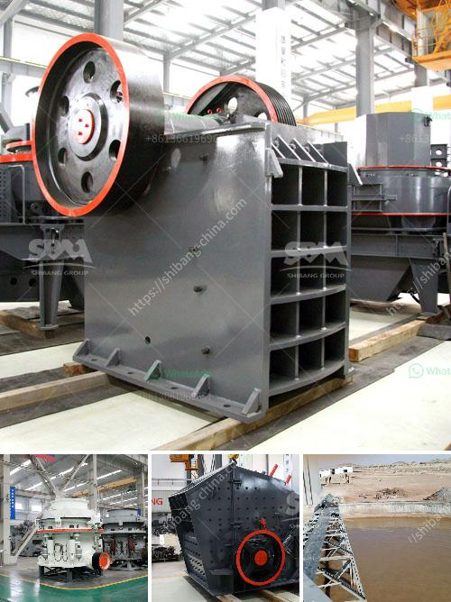

<h3>stone grinding plant equipment specification</h3>
Stone grinding plant is one of the traditional grinding plants that are commonly used in various industries, such as construction, mining, metallurgy, and chemical. Stone grinding plant equipment includes a wide range of equipment, such as crushers, mills, conveyors, classifiers, dust collectors, vibrating screens, and grinding mills. Each type of equipment has its own specifications and requirements to ensure efficient and reliable operation.

The first equipment in a stone grinding plant is crushers. Crushers are used to reduce large rocks into smaller stones or gravel. There are different types of crushers available, such as jaw crushers, cone crushers, impact crushers, and hammer crushers. The choice of crusher depends on the size and hardness of the material being processed.

Once the stones are crushed, they are then sent to the grinding mill for further processing. Grinding mills are used to grind the crushed stones into a fine powder or a desired particle size. There are different types of grinding mills, such as ball mills, Raymond mills, vertical mills, and ultrafine mills. Each type of mill has its own advantages and specifications, and the selection depends on the specific requirements of the application.

Conveyors are an essential part of a stone grinding plant as they are used to transport the stone materials from one processing stage to another. They can be used to move both the crushed stones from the crushers to the grinding mills and the finished products from the grinding mills to the storage or packaging area. Conveyors come in various sizes and types, such as belt conveyors, chain conveyors, and screw conveyors, each designed to handle different types and amounts of materials.

Classifiers are another crucial equipment in a stone grinding plant. They are used to separate the ground materials into different sizes or grades. This is important for ensuring the quality and consistency of the final product. Common types of classifiers include vibrating screens and air classifiers. Vibrating screens are used to separate the materials based on size, while air classifiers use air flow to separate the materials based on density.

Dust collectors play a significant role in stone grinding plants as they help control and minimize airborne dust particles. Dust collectors are designed to capture and filter the dust generated during the grinding process, preventing it from escaping into the environment. They come in different sizes and configurations, depending on the volume and type of dust being produced.

In conclusion, stone grinding plant equipment includes various types of machinery, each with its own specifications and requirements. A well-designed stone grinding plant should have the appropriate equipment to ensure efficient and reliable operation. Whether it's crushers, mills, conveyors, classifiers, dust collectors, or vibrating screens, each piece of equipment plays a vital role in the stone grinding process. By selecting the right equipment for the specific application and following the necessary specifications, a stone grinding plant can achieve optimal performance and deliver high-quality products.
<h3>Contact us</h3><ul><li><strong>Whatsapp:&nbsp;<a href="https://wa.me/8613661969651">+8613661969651</a></strong></li><li><a href="https://swt.shibang-china.com/?git&amp;zhl&amp;stone grinding plant equipment specification"><strong>Online Service(chat now)</strong></a></li></ul><h3>Related</h3><ul><li><a href='hp cone crusher.md'>hp cone crusher</a></li><li><a href='price of quarry crusher in zimbabwe.md'>price of quarry crusher in zimbabwe</a></li><li><a href='coal mill grinding roller.md'>coal mill grinding roller</a></li><li><a href='feldspar crusher cost.md'>feldspar crusher cost</a></li><li><a href='stone crusher buatan indonesia.md'>stone crusher buatan indonesia</a></li></ul>