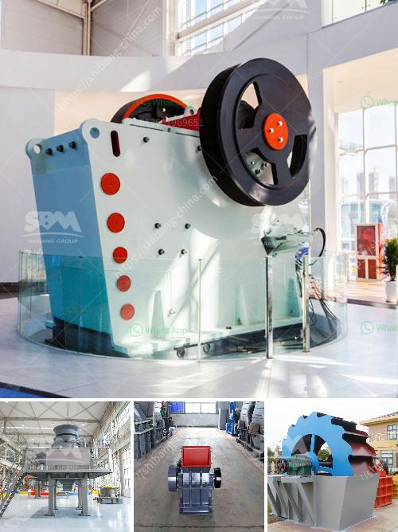

<h3>stone jaw crusher for rock crushing</h3>
A stone crusher is a machine designed to reduce large rocks into smaller rocks, gravel, or rock dust. Crushers may be used to reduce the size, or change the form, of waste materials so they can be more easily disposed of or recycled, or to reduce the size of a solid mix of raw materials (as in rock ore), so that pieces of different composition can be differentiated. Crushing is the process of transferring a force amplified by mechanical advantage through a material made of molecules that bond together more strongly, and resist deformation more, than those in the material being crushed do.

One of the most commonly used crushing machines is the jaw crusher. It is a heavy-duty machine that is generally used for crushing different kinds of raw materials into smaller pieces. The jaw crushers can be seen in the mining and disposal industry where large rocks need to be crushed into smaller pieces for further use. There are different jaw crushers on the market, but all of them are designed and manufactured for rock crushing.

Evaluating the features of stone jaw crushers, we can conclude that they offer several advantages over other crushing machines. They have a high processing capacity, which means that they can crush large stones or rocks into smaller particles quickly. The stone jaw crusher is capable of processing up to 300 tons per hour, depending on the model.

Another important thing to consider when evaluating a stone jaw crusher is its efficiency. It takes less energy to break stones of a certain thickness than other crushing machines, which means that it reduces the cost of operation. Additionally, it requires less maintenance compared to other machines. The jaw crusher is designed to be a self-sufficient machine, which means that it doesn't require constant supervision or additional equipment to operate.

Durability is a key factor when choosing a stone jaw crusher. Its heavy-duty construction ensures that it can withstand the harsh conditions of a quarry or mining site. The materials used in its fabrication are resistant to wear and tear, making the jaw crusher a long-lasting and reliable option for rock crushing.

Furthermore, stone jaw crushers offer versatility in crushing operations. Different models can handle various types of rocks, including granite, limestone, and sandstone. They can also be used to crush concrete, asphalt, and other construction waste materials. This adaptability makes the jaw crusher a valuable piece of equipment in various industries.

In conclusion, the stone jaw crusher is a versatile and efficient machine that helps to tackle many challenges in the crushing industry. With its high processing capacity, durability, and low maintenance needs, it is ideal for rock crushing in quarries and mining sites. The jaw crusher also offers a cost-effective solution for reducing waste materials and increasing recycling opportunities. Overall, the stone jaw crusher is a worthy investment for any business involved in rock crushing.
<h3>Contact us</h3><ul><li><strong>Whatsapp:&nbsp;<a href="https://wa.me/8613661969651">+8613661969651</a></strong></li><li><a href="https://swt.shibang-china.com/?git&amp;zhl&amp;stone jaw crusher for rock crushing"><strong>Online Service(chat now)</strong></a></li></ul><h3>Related</h3><ul><li><a href='mobile gold processing plant 1 2 tph.md'>mobile gold processing plant 1 2 tph</a></li><li><a href='river stone crushing plant for sale.md'>river stone crushing plant for sale</a></li><li><a href='mini stone crusher machine in finland.md'>mini stone crusher machine in finland</a></li><li><a href='cement cement grinding ball mill.md'>cement cement grinding ball mill</a></li><li><a href='price mobile crusher.md'>price mobile crusher</a></li></ul>