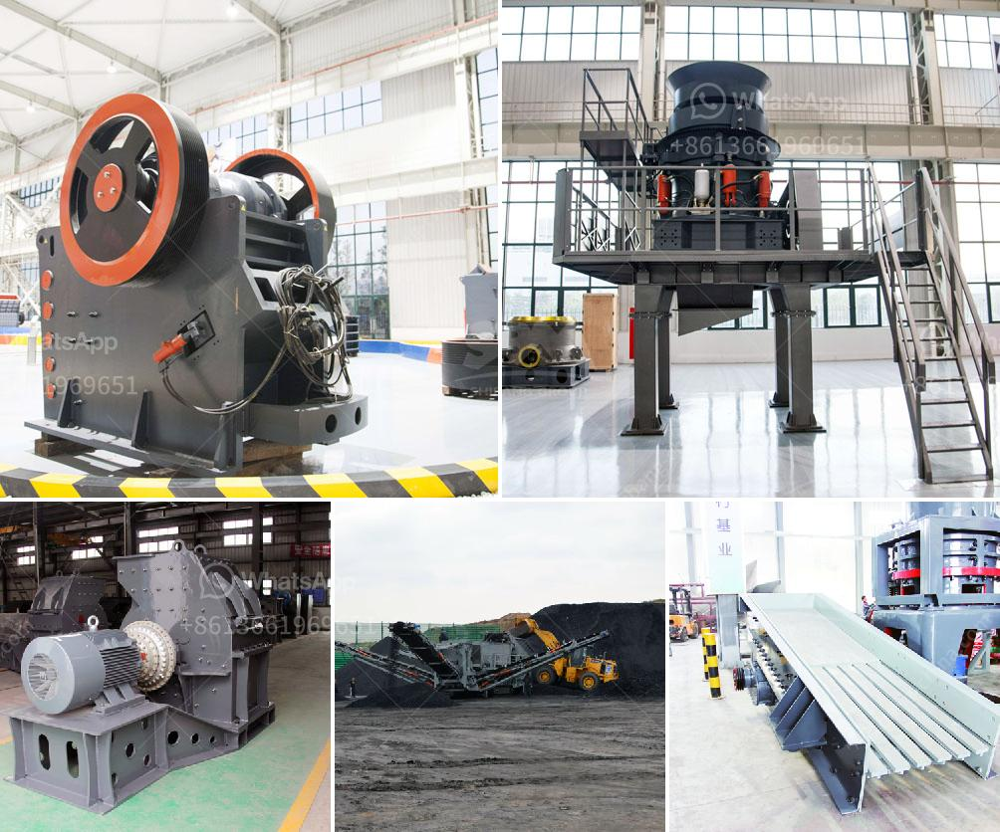

<h3>stone processing equipment in south africa</h3>
South Africa is rich in natural resources, including a diverse array of stones. Mining in South Africa has been a significant industry since the early days of colonization, and the country is known for its vast mineral reserves. Stone quarrying and processing have become major sectors that contribute to the country's economy. The stone processing equipment industry plays a vital role in supporting and enhancing these sectors.

Stone processing equipment refers to machinery that is used for cutting, shaping, polishing, and finishing stones. These machines are used extensively in the quarrying and mining industries to extract and process stones of various types and sizes. From granite and marble to sandstone and slate, stone processing equipment offers the tools necessary for effective and efficient stone extraction and processing. South Africa is home to a wide variety of stones, making the stone processing equipment sector a crucial link in the country's industrial chain.

One of the key players in the stone processing equipment industry in South Africa is Xiamen Abacos Trading Co., Ltd. This company specializes in the production and supply of high-quality stone processing equipment, including bridge saws, diamond wire saws, and edge polishing machines. These machines are designed to cater to the demands of stone quarrying and processing operations of all sizes and complexities.

Bridge saws are one of the most commonly used stone processing equipment in South Africa. These machines are utilized for cutting stones into specific dimensions and shapes. Bridge saws from Xiamen Abacos Trading Co., Ltd., for instance, come equipped with advanced cutting technology, ensuring precise and clean cuts. These machines aid in the production of slabs, tiles, and other stone products demanded by the construction and interior design sectors.

Diamond wire saws are another essential stone processing equipment used in South Africa. These machines employ a diamond-impregnated wire for cutting through stones with extreme precision. Diamond wire saws are highly efficient and versatile, capable of cutting through large blocks of stone. They are particularly useful in the extraction of dimension stones like marble and granite.

Edge polishing machines play a crucial role in the finishing process of stones. These machines are responsible for giving stones their final polished appearance. Edge polishing machines from Xiamen Abacos Trading Co., Ltd. are designed to enhance productivity while ensuring high-quality finishes. These machines utilize advanced technology and come equipped with features such as automatic tool changers and computerized controls.

Stone processing equipment in South Africa has witnessed significant advancements in recent years. These advancements have resulted in enhanced performance and efficiency, allowing for higher production rates and improved quality. The use of advanced technology in stone processing equipment has also contributed to the reduction of manual labor, ensuring worker safety, and increasing overall productivity.

In conclusion, stone processing equipment plays a critical role in the stone quarrying and processing sectors in South Africa. The availability of high-quality machinery has allowed for efficient extraction and processing of stones, contributing to the country's economy. By investing in advanced technology, South Africa can continue to enhance its industrial sector and remain a significant player in the global stone industry.
<h3>Contact us</h3><ul><li><strong>Whatsapp:&nbsp;<a href="https://wa.me/8613661969651">+8613661969651</a></strong></li><li><a href="https://swt.shibang-china.com/?git&amp;zhl&amp;stone processing equipment in south africa"><strong>Online Service(chat now)</strong></a></li></ul><h3>Related</h3><ul><li><a href='stone crushing plant price list.md'>stone crushing plant price list</a></li><li><a href='cost of lime stone crusher plant.md'>cost of lime stone crusher plant</a></li><li><a href='crusher for sale 120 ton.md'>crusher for sale 120 ton</a></li><li><a href='used stone crushers for sale germany.md'>used stone crushers for sale germany</a></li><li><a href='jaw crusher of zenith.md'>jaw crusher of zenith</a></li></ul>