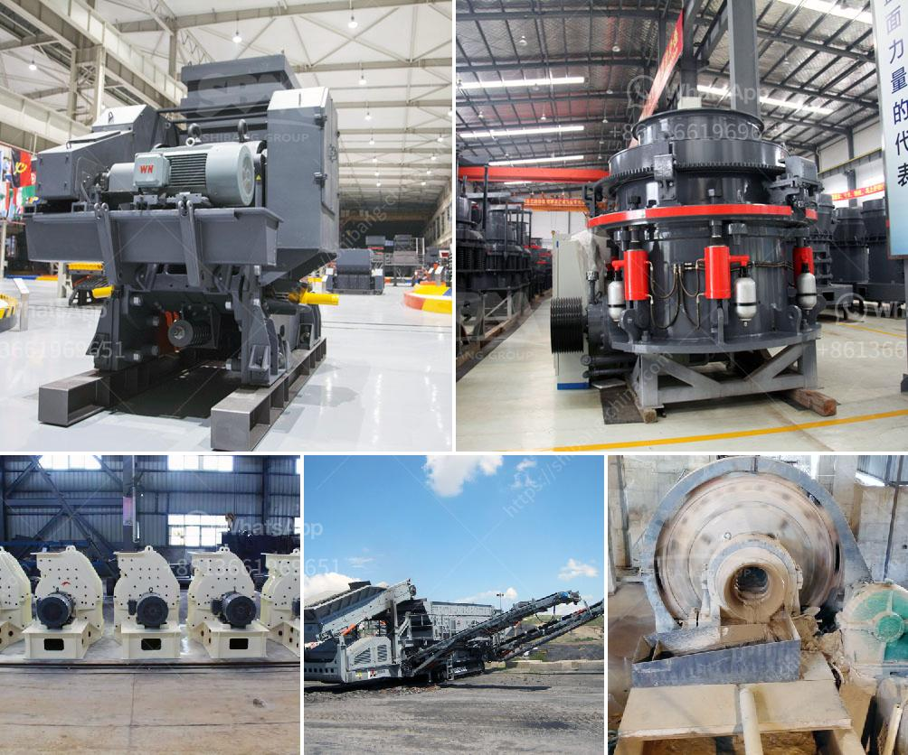

<h3>stone quarries in mpumalanga</h3>
Stone quarries in Mpumalanga play a vital role in the construction industry and contribute to the local economy. Mpumalanga, a province in South Africa, is renowned for its rich geological deposits, making it fertile ground for quarrying activities.

These quarries are essential in providing the raw materials needed for construction projects, including roadways, buildings, and other infrastructure developments. The extracted stone is used for various purposes such as aggregate in concrete, asphalt, and road base materials. It is also used for building blocks, cladding, and landscaping purposes. The quality and diversity of stone available in Mpumalanga make it a preferred choice for both local and international markets.

Furthermore, these quarries employ a significant number of people, creating job opportunities in the region. The work ranges from skilled individuals operating heavy machinery to manual laborers involved in extraction and processing. The employment generated by this industry helps stimulate economic growth, reduce unemployment, and uplift local communities.

Despite the unquestionable benefits of stone quarries, it is crucial to ensure that they are operated sustainably and in line with environmental regulations. Mining activities can have a significant impact on the environment, including land degradation, water pollution, and loss of biodiversity. Responsible quarries mitigate these effects through proper environmental management practices, rehabilitation of mined land, and ensuring compliance with regulations.

Moreover, collaboration between the quarry industry and local communities is vital to address any concerns or issues that may arise. Engaging in open dialogue, providing employment opportunities, and contributing to community development projects are ways in which quarries can build positive relationships with the community.

In conclusion, stone quarries in Mpumalanga play an integral role in the construction industry and contribute to the economy. Their operations generate employment opportunities, foster economic growth, and provide essential raw materials for various construction projects. However, it is vital for quarries to be operated sustainably and in harmony with the environment, while also engaging with local communities to build mutually beneficial relationships.
<h3>Contact us</h3><ul><li><strong>Whatsapp:&nbsp;<a href="https://wa.me/8613661969651">+8613661969651</a></strong></li><li><a href="https://swt.shibang-china.com/?git&amp;zhl&amp;stone quarries in mpumalanga"><strong>Online Service(chat now)</strong></a></li></ul><h3>Related</h3><ul><li><a href='harga mobile stone crusher surabaya.md'>harga mobile stone crusher surabaya</a></li><li><a href='crawler type mobile crusher plant.md'>crawler type mobile crusher plant</a></li><li><a href='ball mill manufacturer for slag crushing.md'>ball mill manufacturer for slag crushing</a></li><li><a href='portable sand and gravel wash plants for sale.md'>portable sand and gravel wash plants for sale</a></li><li><a href='gold ore hammer mills prices mining supplies in zimbabwe.md'>gold ore hammer mills prices mining supplies in zimbabwe</a></li></ul>