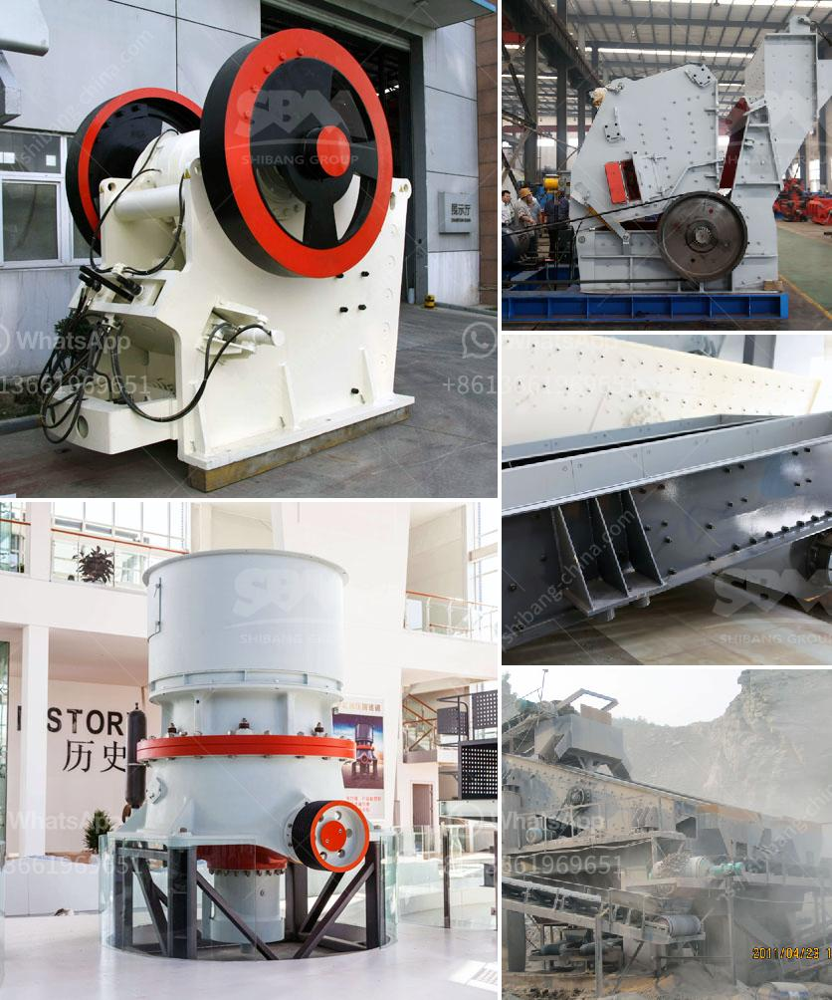

<h3>stone quarry crusher companies in ghana</h3>
Stone quarry crusher companies in Ghana are responsible for the aggregate production in the region. The quarry crusher plant consists of three stages of crushing. The main characteristics of the crushers are their operating principles, feed sizes and output capacities. They are designed for different material types and required product sizes. The capacity ranges from 50 to 500 tons per hour.

Stone quarry crusher companies in Ghana utilize the wide range of crushers for their quarrying operations. Some of the crushers which are currently used at quarrying sites in Ghana include gyratory crushers, jaw crushers, hydraulic cone crushers, vertical shaft impact crushers, and mobile crushers.

Gyratory crushers are the most traditional and commonly used crushers for stone quarrying operations. It is generally used as the primary crusher in the crushing circuit. Jaw crushers are also utilized in the primary stage of quarrying operations. They are designed for medium to large feed sizes and produce highly cubical products.

Hydraulic cone crushers are used for secondary and tertiary crushing. They have the advantage of producing fine and evenly sized products. Also, their design allows for easy maintenance and operation. Vertical shaft impact crushers, on the other hand, produce sand and aggregate by crushing the rock into small particles in a high-speed rotor.

Mobile crushers have become popular in recent years due to their flexibility and mobility. They can be transported to different quarry sites easily and can crush a wide range of materials, including concrete, asphalt, and natural stone. This makes them ideal for temporary quarrying operations or when a specific material needs to be crushed on-site.

In conclusion, stone quarry crusher companies in Ghana are responsible for the aggregate production in the country. They utilize a variety of crushers for quarrying operations, including gyratory, jaw, hydraulic cone, vertical shaft impact, and mobile crushers. These crushers are flexible, efficient, and reliable, making them a crucial asset for any stone quarrying company.
<h3>Contact us</h3><ul><li><strong>Whatsapp:&nbsp;<a href="https://wa.me/8613661969651">+8613661969651</a></strong></li><li><a href="https://swt.shibang-china.com/?git&amp;zhl&amp;stone quarry crusher companies in ghana"><strong>Online Service(chat now)</strong></a></li></ul><h3>Related</h3><ul><li><a href='gypsum powder production.md'>gypsum powder production</a></li><li><a href='used gold mill for sale south africa.md'>used gold mill for sale south africa</a></li><li><a href='caco3 carbonate calcium line production.md'>caco3 carbonate calcium line production</a></li><li><a href='crusher for aggregate.md'>crusher for aggregate</a></li><li><a href='chromite ore crushing machine.md'>chromite ore crushing machine</a></li></ul>