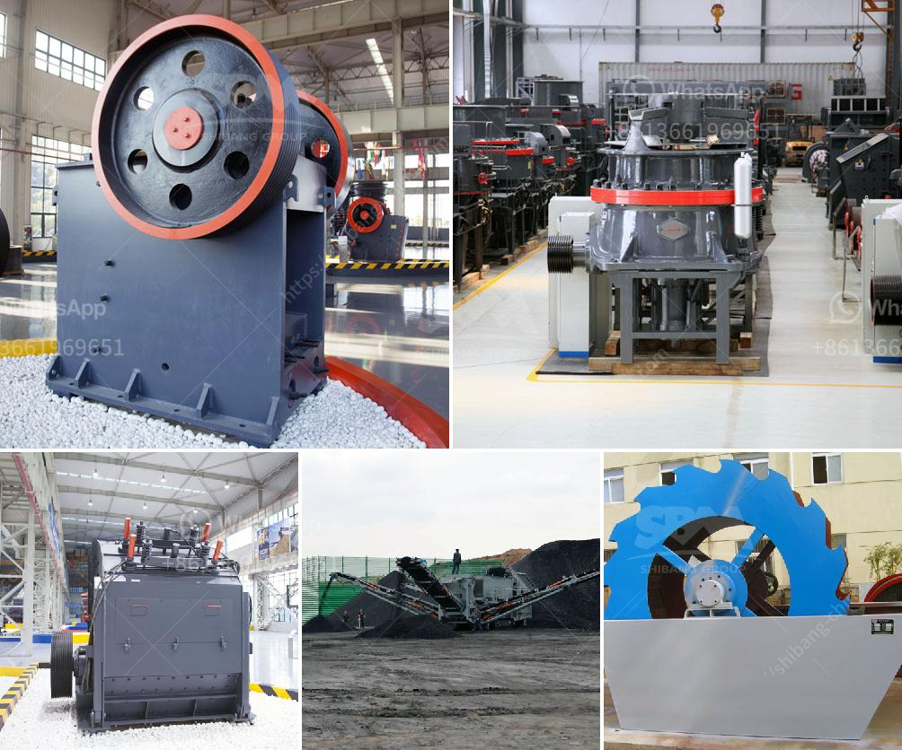

<h3>stone quarry crusher plant price in india</h3>
India has a large number of stone quarries operating across different states and regions in the country. From rocks to usable construction materials, these quarries play a significant role in India's economic development. Stone quarrying is an important sector in India, as it provides construction materials for various infrastructure projects such as roads, highways, bridges, buildings, and dams.

A stone quarry crusher plant is a profitable venture for new entrepreneurs. The demand for quality stone chips is increasing day-by-day. Stone quarrying industry is an important industrial sector in the country. The crushed stone is then used as raw material for various construction activities i.e., construction of roads, bridges, buildings and canals.

Over the last 10 years, the construction sector has been registering strong growth rates in the range of 7-8%. Housing and urban development projects are driving the growth of the construction industry, which, in turn, is boosting the demand for stone aggregates.

The stone quarry crusher plant is a comprehensive production line, which includes rock crushing plant, vibrating feeder, jaw crusher, impact crusher, vibrating screen, belt conveyor, and centralized electric control. The ability of a stone crusher plant to crush stones and rocks as desired is influenced by several factors.

Firstly, the type of stone crushers being used in the plant is essential. The quality is an important factor for crushing stone materials. Crushing machines with good quality will be able to produce high-quality products and generate great profits for the company.

Secondly, the crushing plant should have a safety alarm device, which can ensure safety to the work personnel.

Thirdly, the use of advanced technology during the production process will help improve the quality of the stone aggregates. For instance, cone crushers and jaw crushers are often equipped with the latest technology such as computerized control systems, which can increase the productivity and efficiency of the crushing operation.

Lastly, the location of the stone quarry crusher plant is an important factor. The location should have easy access to marketplaces and transportation facilities. After all, the transport of the construction materials from the quarry to the construction sites consumes a significant amount of time and resources.

In terms of pricing, the stone quarry crusher plant price in India varies widely depending on the application of the stones and the specific requirements of the clients. In general, the price range starts from around INR 70,000 and can go up to over INR 9.5 million. The specific price depends on factors such as the capacity of the crushing plant, the input size of the stones, the desired output size, and the project requirements.

Stone quarry crusher plants can be customized according to the specific requirements of customers. Some of the key customization options include the possibility to choose the type of crusher and the required output capacity. Typically, the more significant the capacity of the crusher plant, the higher the price.

In conclusion, the stone quarry crusher plant price in India varies widely depending on the specific requirements of the clients and the different types of crushers. The crushing plant's capacity, input size, and output size are important factors to consider when selecting the right crusher for a quarry site. Making a detailed comparison between different options and choosing the right equipment for the job will ensure maximum profitability and productivity for the stone quarrying business.
<h3>Contact us</h3><ul><li><strong>Whatsapp:&nbsp;<a href="https://wa.me/8613661969651">+8613661969651</a></strong></li><li><a href="https://swt.shibang-china.com/?git&amp;zhl&amp;stone quarry crusher plant price in india"><strong>Online Service(chat now)</strong></a></li></ul><h3>Related</h3><ul><li><a href='river sand garnet processing machines.md'>river sand garnet processing machines</a></li><li><a href='suppliers of ball mill in bhopal.md'>suppliers of ball mill in bhopal</a></li><li><a href='cost of a hammer mill.md'>cost of a hammer mill</a></li><li><a href='three roller mill in china.md'>three roller mill in china</a></li><li><a href='quartz grinding ball mill.md'>quartz grinding ball mill</a></li></ul>