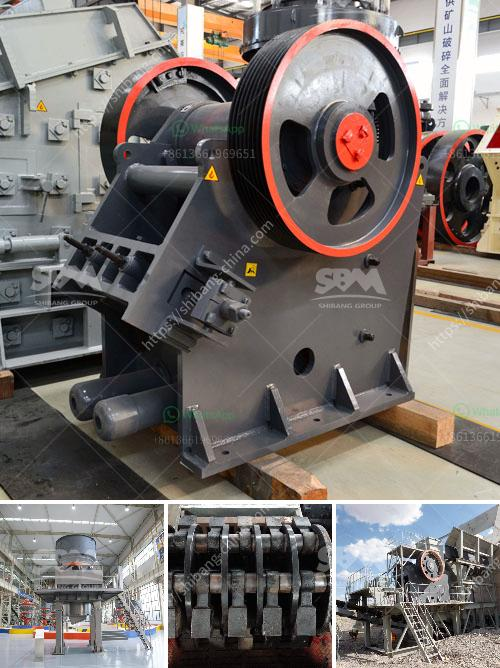

<h3>stone quarry drill machine crushers prices</h3>
Stone quarry drill machine crushers play an important role in the mining industry, helping to improve efficiency and reduce operational costs. Quarry owners have the option to choose their desired crushers based on their production capacities.

Crushers are crucial for processing large rocks into smaller, more manageable sizes for transportation to the next stage of crushing or screening. They can be powered by diesel engines or electric motors, depending on the location and availability of power sources. Prices for stone quarry drill machine crushers can vary greatly depending on factors such as the capacity and power of the machine.

Many quarry owners have a preference for crushers that can provide high production capacities at relatively low costs. These crushers are designed to handle large quantities of material efficiently, reducing the need for multiple machines and streamlining the crushing process. The prices for such crushers typically range from $100,000 to $500,000.

When choosing a stone quarry drill machine crusher, it is important to consider factors such as the type and hardness of the material to be crushed, the desired output size, and the machine's operating costs. Crushers are available in different configurations to suit these requirements.

Jaw crushers are commonly used in stone quarries due to their ability to crush hard and abrasive materials. They are typically priced between $100,000 and $300,000. Cone crushers are also widely used in quarries and can provide a more precise and uniform product size. These crushers are priced between $200,000 and $400,000.

Impact crushers are another popular option for stone quarry drill machine crushers. They can be used to crush a variety of materials, including limestone, granite, and sandstone. Impact crushers are typically priced between $300,000 and $500,000. These machines are known for their high production capacities and low operating costs, making them an attractive choice for quarry owners.

Quarry owners should also consider the maintenance and spare parts costs associated with the chosen crusher. Regular maintenance is essential to ensure the smooth operation of the machine, and spare parts may need to be replaced over time. It is important to choose a crusher with readily available spare parts and support from the manufacturer or supplier.

In conclusion, stone quarry drill machine crushers are essential equipment in the mining industry. When choosing a crusher, quarry owners should consider factors such as production capacity, power source, desired output size, and operating costs. Prices for these crushers can range from $100,000 to $500,000, depending on the type and capacity of the machine. Additionally, maintenance and spare parts costs should also be taken into account to ensure smooth operations.
<h3>Contact us</h3><ul><li><strong>Whatsapp:&nbsp;<a href="https://wa.me/8613661969651">+8613661969651</a></strong></li><li><a href="https://swt.shibang-china.com/?git&amp;zhl&amp;stone quarry drill machine crushers prices"><strong>Online Service(chat now)</strong></a></li></ul><h3>Related</h3><ul><li><a href='sand sieving machine by vibrating system chennai.md'>sand sieving machine by vibrating system chennai</a></li><li><a href='cement plant for sale intpd.md'>cement plant for sale intpd</a></li><li><a href='used stone crusher for sale in italy.md'>used stone crusher for sale in italy</a></li><li><a href='used 900 cone crusher for sale.md'>used 900 cone crusher for sale</a></li><li><a href='rock crusher companies.md'>rock crusher companies</a></li></ul>