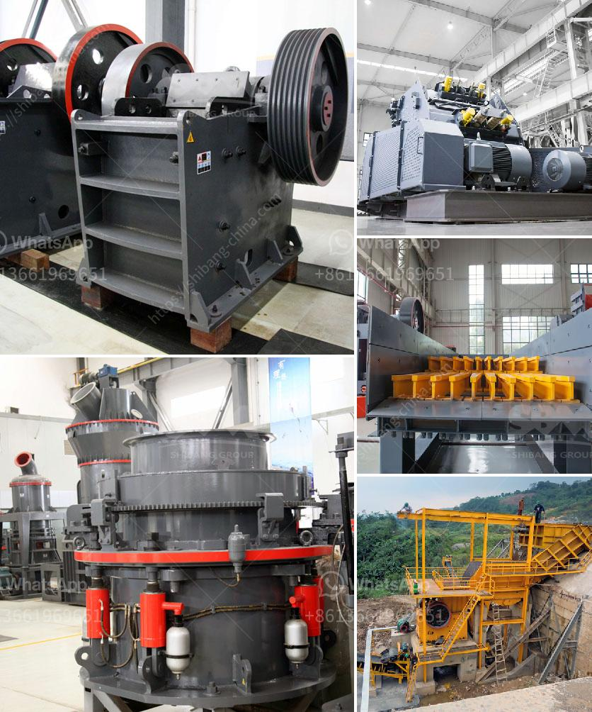

<h3>stone transport belt conveyor</h3>
A stone transport belt conveyor is a highly efficient and reliable system used to move large volumes of stones or pebbles from one location to another. This type of conveyor is commonly utilized in industries such as mining, construction, and landscaping.

The conveyor system consists of a belt that is continuously looped and rotates around two or more pulleys. The stones are placed on the belt, and as it moves, the stones are transported to the desired destination. This technology eliminates the need for manual labor and significantly increases productivity.

One of the key advantages of a stone transport belt conveyor is its ability to handle a wide range of stone sizes and shapes. It can transport small pebbles as well as large rocks with ease. This versatility makes it suitable for a variety of applications, including loading and unloading trucks, stockpiling materials, and feeding crushers or screening machines.

Furthermore, the conveyor belt is equipped with a series of cleats or ribs that provide traction and prevent the stones from slipping or falling off the belt. This feature ensures that the stones are securely transported without any loss of material, minimizing wastage and increasing efficiency.

In addition to its efficiency, a stone transport belt conveyor is also cost-effective. Its low power consumption and minimal maintenance requirements contribute to lower operating costs compared to alternative methods of stone transportation.

When designing a stone transport belt conveyor, factors such as the volume and type of stones, the conveyor length, the speed of the belt, and any specific requirements of the application must be considered. Customization options are available to suit individual project needs, ensuring optimal performance and functionality.

Overall, a stone transport belt conveyor is an essential component in various industries where the efficient movement of stones is crucial. Its ability to handle large volumes of materials, its versatility, and its cost-effectiveness make it an essential tool for streamlining operations and enhancing productivity.
<h3>Contact us</h3><ul><li><strong>Whatsapp:&nbsp;<a href="https://wa.me/8613661969651">+8613661969651</a></strong></li><li><a href="https://swt.shibang-china.com/?git&amp;zhl&amp;stone transport belt conveyor"><strong>Online Service(chat now)</strong></a></li></ul><h3>Related</h3><ul><li><a href='vibrating screen manufacture in philippines.md'>vibrating screen manufacture in philippines</a></li><li><a href='crusher power consumption.md'>crusher power consumption</a></li><li><a href='design of coal screen.md'>design of coal screen</a></li><li><a href='chromite ore crushing machine.md'>chromite ore crushing machine</a></li><li><a href='price of quarry crusher in zimbabwe.md'>price of quarry crusher in zimbabwe</a></li></ul>