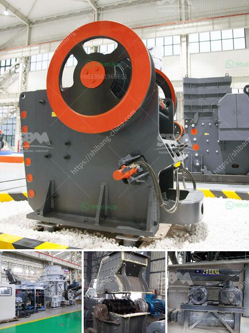

<h3>suppliers of ball mill in bhopal</h3>
Ball mills are a fundamental part of the manufacturing industry in Bhopal, Madhya Pradesh. Ball mills are used for grinding and mixing materials such as minerals, ores, pyrotechnics, paints, and ceramics. The balls rotate with the materials and grind them down, resulting in a finer and more homogeneous product.

In Bhopal, there are several suppliers of ball mills that cater to the diverse needs of various industries. These suppliers offer a range of ball mills, from small laboratory mills to larger industrial-grade mills. The suppliers are committed to providing high-quality machines that are reliable, efficient, and cost-effective.

One of the renowned suppliers of ball mills in Bhopal is XYZ Engineering. They have been serving the industry for over a decade, providing cutting-edge solutions for grinding and mixing processes. XYZ Engineering offers ball mills with different specifications and capacities to meet the specific requirements of their clients. They understand the importance of customizing the machines to suit the unique needs of different industries.

Another reputable supplier in Bhopal is ABC Machinery. They are known for their expertise in manufacturing and supplying high-quality ball mills. ABC Machinery focuses on delivering innovative and efficient solutions to maximize productivity. They offer a wide range of ball mills, from small-scale laboratory mills to large-scale industrial mills. Their experienced team of engineers ensures that the machines are of the highest quality and meet international standards.

Suppliers like XYZ Engineering and ABC Machinery not only provide ball mills but also offer comprehensive after-sales services. They have a team of skilled technicians who provide installation, maintenance, and repair services for the machines. This ensures that the ball mills operate at their optimum level of performance throughout their lifespan.

The suppliers in Bhopal prioritize customer satisfaction and strive to build long-term relationships with their clients. They understand the importance of timely delivery and offer efficient logistics support. Whether it is a small-scale laboratory or a large industrial project, the suppliers in Bhopal are well-equipped to handle the demands of their clients.

In conclusion, the availability of reliable and efficient ball mills is crucial for the manufacturing industry in Bhopal. The suppliers in the region understand this need and provide a wide range of ball mills that cater to the diverse needs of different industries. Suppliers like XYZ Engineering and ABC Machinery have established themselves as trusted providers of high-quality machines. These suppliers not only offer a variety of ball mills but also provide comprehensive after-sales services. With their commitment to customer satisfaction and efficient logistics support, the suppliers in Bhopal are the go-to choice for anyone in need of ball mills for their grinding and mixing processes.
<h3>Contact us</h3><ul><li><strong>Whatsapp:&nbsp;<a href="https://wa.me/8613661969651">+8613661969651</a></strong></li><li><a href="https://swt.shibang-china.com/?git&amp;zhl&amp;suppliers of ball mill in bhopal"><strong>Online Service(chat now)</strong></a></li></ul><h3>Related</h3><ul><li><a href='gold processing mecury sales gauteng.md'>gold processing mecury sales gauteng</a></li><li><a href='process of preparation of coal and asha.md'>process of preparation of coal and asha</a></li><li><a href='ball mill manufacturing manufacturing process.md'>ball mill manufacturing manufacturing process</a></li><li><a href='gold mill equipment zimbabwe.md'>gold mill equipment zimbabwe</a></li><li><a href='new gypsum board plant in india.md'>new gypsum board plant in india</a></li></ul>