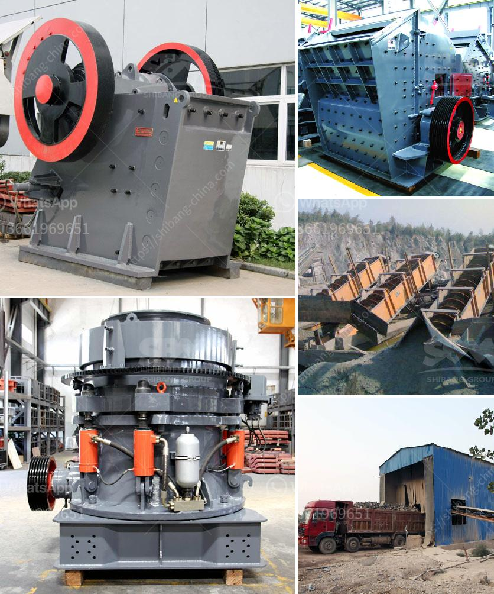

<h3>suppliers of coveyor belting in durban</h3>
Durban, located in the province of KwaZulu-Natal, South Africa, is a bustling city known for its busy port and industrial sector. With numerous businesses operating in the region, the demand for conveyor belting is high to facilitate the smooth movement of goods and materials across various industries. Fortunately, Durban is home to several reputable suppliers of conveyor belting, ensuring businesses have a reliable source to meet their needs.

One such supplier is Company A, which has been serving the Durban market for over two decades. Known for their extensive inventory and exceptional customer service, Company A offers a wide range of conveyor belting options to suit different industry requirements. They provide belting solutions for various applications, including mining, manufacturing, and food processing. With a team of experienced technicians, Company A also offers installation, maintenance, and repair services to ensure optimal performance of their products.

Company B is another prominent supplier of conveyor belting in Durban. Their attention to detail and quality products have earned them a solid reputation in the industry. Company B offers a variety of belting materials, ranging from rubber to PVC, to meet the diverse needs of their customers. They specialize in heavy-duty belting for industrial applications and also provide customized solutions based on specific requirements. Additionally, their team of experts offers technical support and guidance to assist customers in selecting the most suitable belting options for their operations.

Lastly, Company C is a trusted name in the conveyor belting industry in Durban. With a comprehensive range of belting products, they cater to the needs of various sectors, including agriculture, construction, and warehousing. Company C prides itself on its quick turnaround time and competitive pricing, ensuring customers get their orders promptly without compromising on quality. They also offer maintenance services, including conveyor belt splicing and repairs, to extend the lifespan and efficiency of the belting systems.

In conclusion, Durban boasts a wide selection of conveyor belting suppliers to support local industries. Whether it is heavy-duty mining belting or food-grade materials, businesses in Durban can rely on reputable suppliers such as Company A, Company B, and Company C. These suppliers not only offer quality products but also provide installation, maintenance, and repair services to ensure long-lasting and efficient conveyor systems. With their expertise and commitment to customer satisfaction, these suppliers play a vital role in keeping Durban's industries moving smoothly.
<h3>Contact us</h3><ul><li><strong>Whatsapp:&nbsp;<a href="https://wa.me/8613661969651">+8613661969651</a></strong></li><li><a href="https://swt.shibang-china.com/?git&amp;zhl&amp;suppliers of coveyor belting in durban"><strong>Online Service(chat now)</strong></a></li></ul><h3>Related</h3><ul><li><a href='stone crushing machine price in india.md'>stone crushing machine price in india</a></li><li><a href='500 tph stone crusher price.md'>500 tph stone crusher price</a></li><li><a href='enquiry about crusher.md'>enquiry about crusher</a></li><li><a href='decibels declined jaw crusher hebro.md'>decibels declined jaw crusher hebro</a></li><li><a href='how to start a stone crushing company in canada.md'>how to start a stone crushing company in canada</a></li></ul>