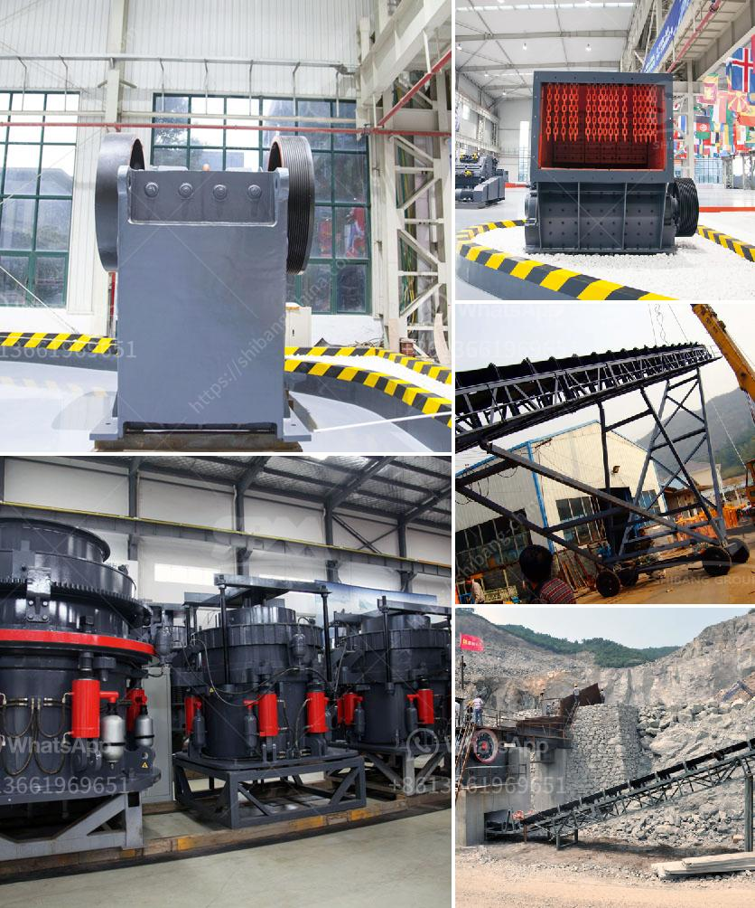

<h3>talc commodity processing facility companies</h3>
Talc is a mineral mainly composed of magnesium silicate, known for its softness and smoothness. It is widely used in various industries such as cosmetics, pharmaceuticals, ceramics, and paints, among others. To meet the growing demand for talc products, numerous commodity processing facility companies have emerged to cater to the market.

These companies specialize in the extraction, processing, and refining of talc. They operate extensive mining operations to obtain the raw material, which is then processed into different grades and particle sizes suitable for various applications. The processing facilities utilize advanced machinery and equipment to ensure the production of high-quality talc products.

One notable advantage of these talc commodity processing facility companies is their ability to tailor talc products to meet specific customer requirements. They work closely with clients to understand their exact needs and provide customized solutions accordingly. This flexibility allows them to cater to diverse industries and applications, ranging from cosmetics powders to industrial coatings.

Moreover, these companies prioritize sustainability and responsible mining practices. They ensure environmentally friendly extraction methods and implement stringent quality control measures throughout the processing operations. This commitment to sustainability not only safeguards the environment but also enhances the overall reputation of the talc industry.

Furthermore, talc commodity processing facility companies play a vital role in promoting employment and economic growth. They create job opportunities for local communities and contribute to regional development. Additionally, by meeting the demand for talc in various industries, they facilitate economic activities and drive productivity.

In conclusion, talc commodity processing facility companies are essential players in the talc industry. They provide customized talc products, promote sustainability, and generate economic growth. With their expertise and dedication, they ensure a steady supply of high-quality talc for diverse applications, enabling various industries to thrive.
<h3>Contact us</h3><ul><li><strong>Whatsapp:&nbsp;<a href="https://wa.me/8613661969651">+8613661969651</a></strong></li><li><a href="https://swt.shibang-china.com/?git&amp;zhl&amp;talc commodity processing facility companies"><strong>Online Service(chat now)</strong></a></li></ul><h3>Related</h3><ul><li><a href='how to make a stone crusher.md'>how to make a stone crusher</a></li><li><a href='stone crusher second.md'>stone crusher second</a></li><li><a href='price of zenithcrusher plant.md'>price of zenithcrusher plant</a></li><li><a href='cone crusher factory south africa.md'>cone crusher factory south africa</a></li><li><a href='crawler type mobile crusher plant.md'>crawler type mobile crusher plant</a></li></ul>