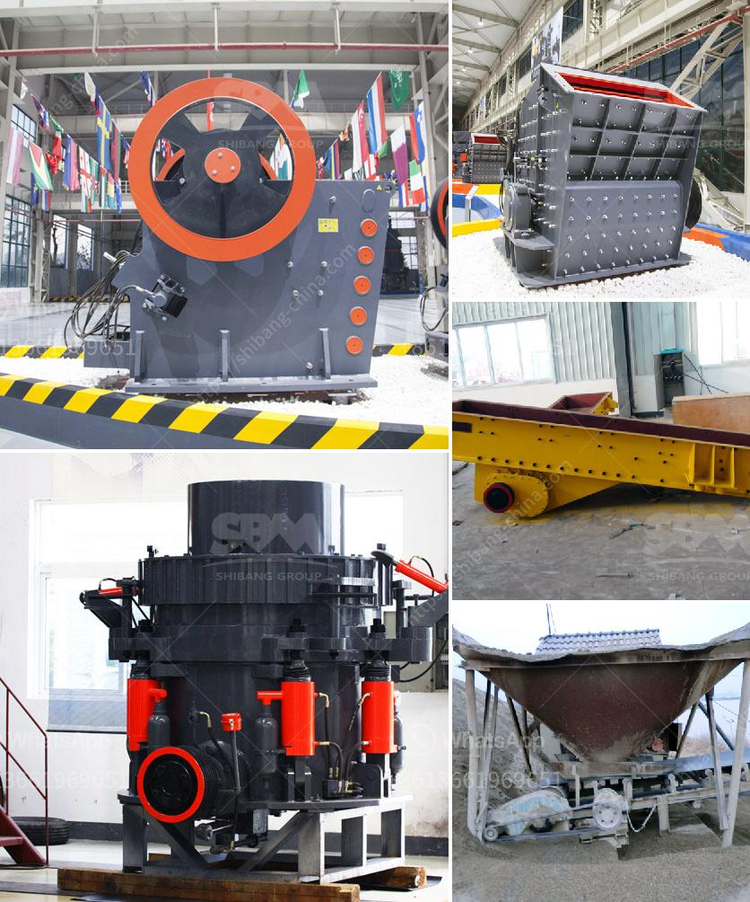

<h3>talc grinding mill plants</h3>
Talc is a soft mineral, known for its ability to absorb moisture and provide lubrication. It is widely used in various industries, including the cosmetic, paint, paper, rubber, and pharmaceutical industries. To meet the growing demand for talc, various manufacturers are investing in talc grinding mill plants.

Talc grinding mill plants are advanced and efficient machines that are designed to produce fine and ultra-fine talc powders. These mills employ cutting-edge grinding technologies to provide the desired particle size distribution for various applications. With the increasing demand for talc powders, these grinding mill plants are crucial for enhancing efficiency in talc processing.

One of the main advantages of talc grinding mill plants is their ability to produce high-quality talc powders. These mills utilize carefully selected grinding media and advanced milling processes to ensure the production of consistent and uniform talc powders. This is particularly important for industries such as cosmetics and pharmaceuticals, where the quality of the product is of utmost importance.

Talc grinding mill plants also offer a wide range of particle size options, allowing manufacturers to tailor the talc powders according to their specific needs. Different industries require different particle sizes, and these mills can produce a wide range, from coarse to ultra-fine talc powders. With such versatility, manufacturers can ensure that their products meet the specific requirements of their respective industries.

Moreover, talc grinding mill plants are designed to be energy-efficient. These mills employ advanced grinding technologies, such as vertical roller mills, which consume less energy compared to traditional ball mills. This not only reduces the production costs but also contributes to sustainable and environmentally friendly operations. Manufacturers can save on energy costs while producing high-quality talc powders.

In addition to their energy efficiency, talc grinding mill plants also offer exceptional throughput rates. These mills are equipped with powerful motors and precision instrumentation that optimize the grinding process. This ensures a continuous operation with minimal downtime, allowing manufacturers to meet the increasing demands of their customers.

Furthermore, modern talc grinding mill plants are equipped with advanced control systems that monitor and control various parameters, such as temperature and pressure. This ensures a stable and consistent grinding process, resulting in high-quality talc powders. The automated systems also minimize human errors, guaranteeing a higher level of accuracy and reproducibility.

In conclusion, talc grinding mill plants are essential for enhancing efficiency in talc processing. These advanced machines produce high-quality and precisely tailored talc powders. They offer a wide range of particle size options, energy-efficient operations, and exceptional throughput rates. With their advanced control systems, these mills ensure stable and consistent grinding processes. Manufacturers investing in talc grinding mill plants can meet the growing demand while enhancing profitability and sustainability.
<h3>Contact us</h3><ul><li><strong>Whatsapp:&nbsp;<a href="https://wa.me/8613661969651">+8613661969651</a></strong></li><li><a href="https://swt.shibang-china.com/?git&amp;zhl&amp;talc grinding mill plants"><strong>Online Service(chat now)</strong></a></li></ul><h3>Related</h3><ul><li><a href='cost of hammer mill.md'>cost of hammer mill</a></li><li><a href='hammer mill mining.md'>hammer mill mining</a></li><li><a href='used hammer mill crusher.md'>used hammer mill crusher</a></li><li><a href='used stone crushers for sale in accra.md'>used stone crushers for sale in accra</a></li><li><a href='stone crusher plates in south africa.md'>stone crusher plates in south africa</a></li></ul>