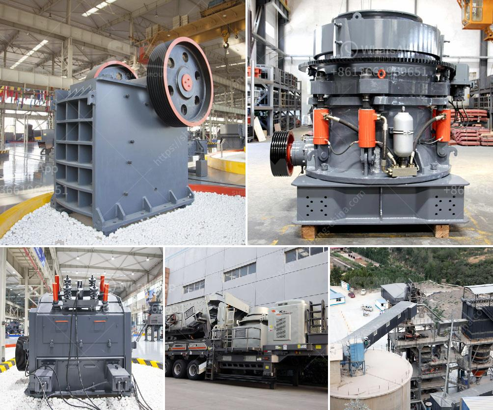

<h3>talc grinding plant</h3>
Talc, a soft and versatile mineral, has multiple industrial and consumer applications. Talc grinding plant covers a wide range of sectors, including the food, automotive, paint, coating, plastic, ceramics, medicine, personal care, and paper industry. Talc grinding plant is an essential part of talc processing, providing a range of outputs from coarse talc powder to fine talc particles. With the growing demand for talc, there is an increased need for innovative talc grinding plants to meet industry requirements effectively.

Talc grinding plants primarily use mechanical and chemical processes, which consist of crushing, grinding, and milling stages to produce a variety of talc powders. The grinding plant is designed to run continuously, allowing for higher production rates and, thus, increased efficiency. Modern grinding plants can process talc to particle sizes ranging from a few microns to tens of microns, depending on the customers' specific needs.

One of the main features of a talc grinding plant is the ability to produce tailored talc powders with different characteristics, such as particle size distribution, brightness, and purity. These characteristics play a crucial role in determining the suitability of talc powders for various applications. For example, talc powders with a fine particle size are commonly used in pharmaceuticals and cosmetics, while coarser talc powders find applications in plastic and paint industries.

In recent years, there has been a growing demand for specialty talc powders with enhanced properties. For instance, talc powders with high brightness and low impurities are sought after by the ceramic and paper industry. Additionally, the automotive industry requires talc powders with specific particle sizes and mechanical properties to improve the performance of plastic components.

To cater to these diversified demands, talc grinding plants are incorporating advanced technologies and equipment. Micronization techniques, such as jet milling and ball milling, are used to achieve precise particle sizes and improve the overall quality of talc powders. Moreover, the use of specialized filters, classifiers, and separators helps in obtaining powders with uniform characteristics.

Furthermore, talc grinding plants are investing in research and development to explore new applications of talc powders. Talc's unique properties of softness, lamellarity, and inertness make it a promising material for innovative products. For example, talc powders are being used in agriculture as an anti-caking agent and soil enhancer. Similarly, talc-based coatings and additives are being studied for their potential in energy storage and thermal management applications.

In conclusion, talc grinding plants are vital for processing talc into various forms that cater to different industry demands. These plants utilize advanced technologies to produce talc powders with tailored characteristics. The growing demand for specialized talc powders has driven the need for continuous innovation in the field. As researchers delve deeper into talc's properties, new applications are being explored, which will further expand the scope of talc grinding plants in the future.
<h3>Contact us</h3><ul><li><strong>Whatsapp:&nbsp;<a href="https://wa.me/8613661969651">+8613661969651</a></strong></li><li><a href="https://swt.shibang-china.com/?git&amp;zhl&amp;talc grinding plant"><strong>Online Service(chat now)</strong></a></li></ul><h3>Related</h3><ul><li><a href='diamond and gold washing plant.md'>diamond and gold washing plant</a></li><li><a href='process of making diamonds from coal.md'>process of making diamonds from coal</a></li><li><a href='singapore mining conveyor belt supplier.md'>singapore mining conveyor belt supplier</a></li><li><a href='project cost estimation for iron ore pellet plant.md'>project cost estimation for iron ore pellet plant</a></li><li><a href='jaw crusher refurbished.md'>jaw crusher refurbished</a></li></ul>