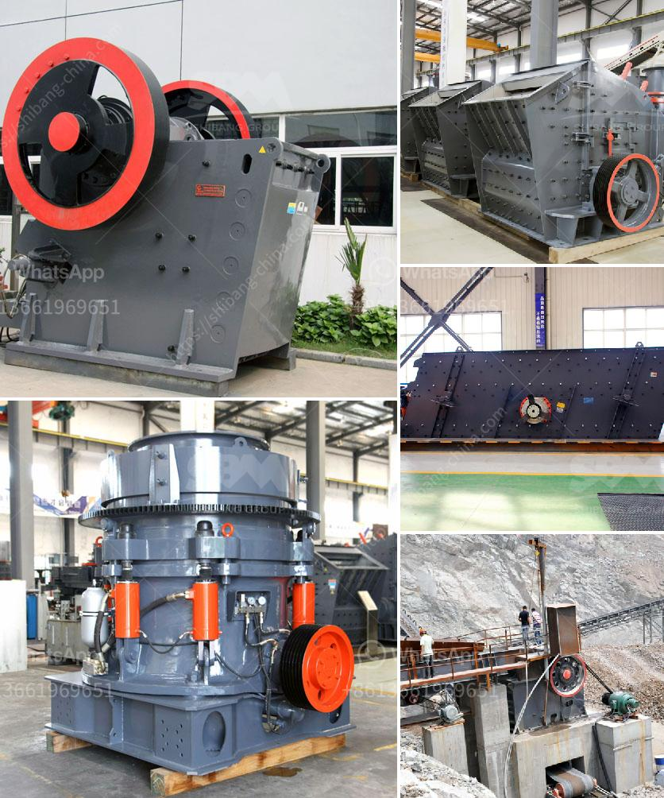

<h3>talc powder grinding mills in lahore</h3>
Talc powder is widely used in various industries, including cosmetics, ceramics, paints, paper-making, and more. The demand for talc powder has been steadily increasing, leading to the development of grinding mills specifically designed for talc grinding. In Lahore, Pakistan, there are several manufacturers and suppliers of talc grinding mills, each catering to different requirements.

Talc grinding mills in Lahore offer state-of-the-art grinding capabilities for talc powder manufacturing. These mills are efficient in processing the coarse and fine grades of talc powder, offering versatile grinding options for various applications. The mills utilize high-quality materials and advanced technology to ensure a consistent particle size distribution, resulting in a fine, uniform talc powder.

The grinding process in these mills involves crushing the raw talc into smaller particles, followed by milling and grinding to achieve the desired fineness. The mills are equipped with precision rotary classifiers, allowing the control of particle size and distribution. The finely ground talc powder is then collected and packed for distribution.

Apart from efficiency and quality, talc grinding mills in Lahore also focus on environmental sustainability. These mills strive to minimize energy consumption and reduce emissions by utilizing energy-efficient machinery and adopting eco-friendly production practices.

The availability of talc grinding mills in Lahore has significantly contributed to the growth of various industries. From cosmetics to ceramics, talc powder finds extensive usage in enhancing the quality and functionality of products. Manufacturers and suppliers in Lahore offer a range of talc grinding mills to cater to the diverse requirements of different industries.

In conclusion, talc powder grinding mills in Lahore play a crucial role in meeting the growing demand for talc powder. These mills offer efficient and sustainable grinding solutions, ensuring the production of high-quality talc powder for various applications. The continuous development and innovation in talc grinding mills contribute to the progress of industries relying on talc powder, making Lahore a key hub for talc grinding.
<h3>Contact us</h3><ul><li><strong>Whatsapp:&nbsp;<a href="https://wa.me/8613661969651">+8613661969651</a></strong></li><li><a href="https://swt.shibang-china.com/?git&amp;zhl&amp;talc powder grinding mills in lahore"><strong>Online Service(chat now)</strong></a></li></ul><h3>Related</h3><ul><li><a href='talc processing plant.md'>talc processing plant</a></li><li><a href='used 200 tph stone crusher sale sale in india.md'>used 200 tph stone crusher sale sale in india</a></li><li><a href='stone crusher machine manufacturer in india.md'>stone crusher machine manufacturer in india</a></li><li><a href='sand screens and sieves dealers contacts.md'>sand screens and sieves dealers contacts</a></li><li><a href='crushing plants south africa.md'>crushing plants south africa</a></li></ul>