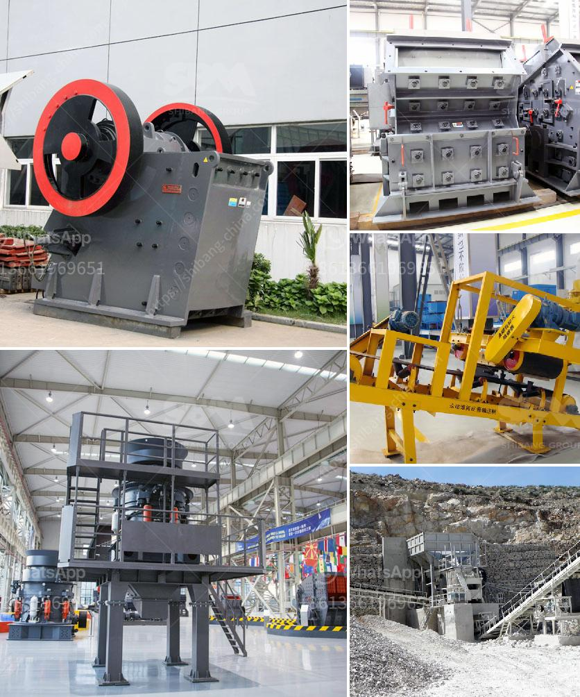

<h3>talc processing plant</h3>
Talc is a naturally occurring mineral known for its softness, smoothness, and moisture-absorbing properties. It is widely used in various industries, including cosmetics, pharmaceuticals, ceramics, plastics, and paint. To meet the growing demand for talc, efficient processing plants play a crucial role in ensuring its availability to these vital sectors.

A talc processing plant is a facility that transforms the raw talc rock into various grades of powder. The process begins with mining the talc ore from underground or open-pit mines. Next, it undergoes primary crushing, secondary crushing, and grinding to obtain the required particle size distribution for the desired applications. This is followed by purification and drying processes to remove impurities and moisture, respectively.

The efficiency and quality of the talc processing plant significantly impact the final products' performance and characteristics. A well-designed plant incorporates advanced technologies, such as modern crushers, mills, and classifiers, to achieve optimal particle size distribution and brightness. It also employs effective purification techniques, like froth flotation and magnetic separation, to eliminate undesirable elements, enhancing talc's purity.

Moreover, an efficient talc processing plant ensures environmentally friendly operations. It employs state-of-the-art dust control systems and equipment to minimize emissions and prevent any potential health hazards. Additionally, it implements sustainable practices, such as recycling water and reusing waste materials, reducing its overall environmental footprint.

The location of a talc processing plant is strategically chosen to ensure proximity to raw material sources and target markets. This minimizes transportation costs and enables timely delivery of products to customers, maintaining a competitive edge in terms of cost-efficiency and reliability.

In conclusion, a talc processing plant plays a vital role in meeting the demand for talc in various industries. With its advanced processes and technologies, it ensures the production of superior quality talc products that meet the specific requirements of each application. Furthermore, it promotes sustainability and eco-friendly practices, contributing to a greener future. As the demand for talc continues to grow, the role of efficient talc processing plants becomes increasingly crucial in shaping the industry's success.
<h3>Contact us</h3><ul><li><strong>Whatsapp:&nbsp;<a href="https://wa.me/8613661969651">+8613661969651</a></strong></li><li><a href="https://swt.shibang-china.com/?git&amp;zhl&amp;talc processing plant"><strong>Online Service(chat now)</strong></a></li></ul><h3>Related</h3><ul><li><a href='philippines crusher equipment.md'>philippines crusher equipment</a></li><li><a href='buy ball mill india.md'>buy ball mill india</a></li><li><a href='gold screening machines south africa.md'>gold screening machines south africa</a></li><li><a href='crusher in sale in nepal.md'>crusher in sale in nepal</a></li><li><a href='how to start a stone crushing company in canada.md'>how to start a stone crushing company in canada</a></li></ul>