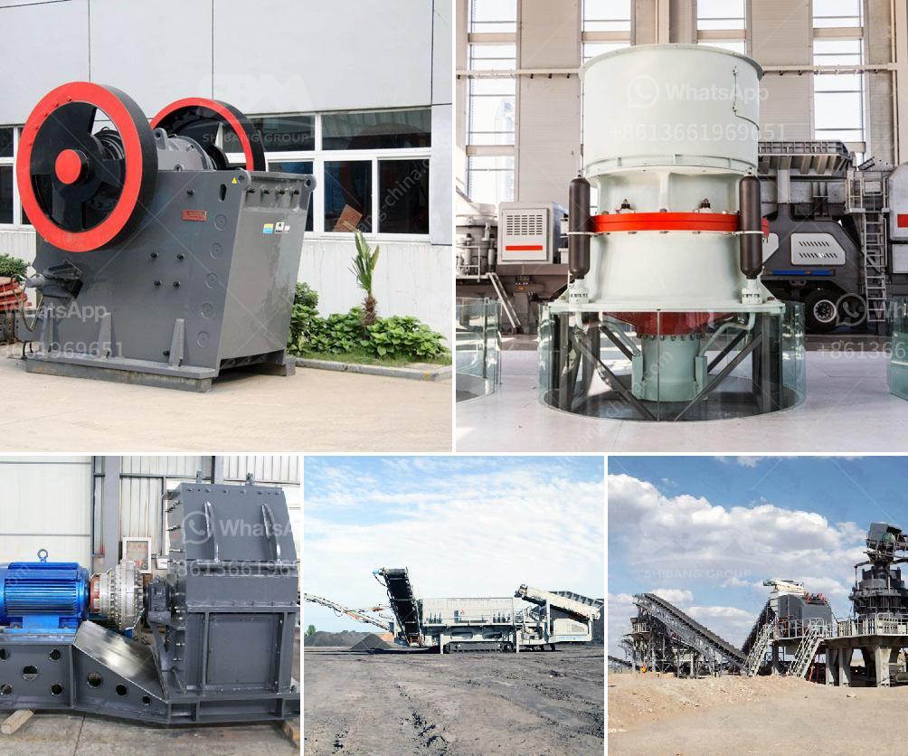

<h3>talcum powder making machinery</h3>
Talcum powder, also known as baby powder, is a common household product used for various purposes. It is often used to absorb moisture and reduce friction on the body, making it popular for applications such as keeping skin dry and preventing chafing. However, have you ever wondered how talcum powder is manufactured? Let's take a closer look at the machinery involved in the production process.

The primary component of talcum powder is talc, a mineral that is mined from the earth. Talc is a soft, white powder with a variety of industrial uses, including in the production of ceramics, paints, and plastics. To transform talc into its familiar baby powder form, specialized machinery is used.

The machinery used for talcum powder production typically includes crushing machines, grinding mills, dryers, classifiers, powder concentrators, and packaging machinery. The process begins with the mining of talc ores from underground deposits.

After the raw ore is extracted, it is crushed and ground into fine particles. This is achieved using crushers and grinding mills, which break down the ore into smaller pieces. The resulting talc powder has a fine, smooth texture and is of high purity.

Next, the talc powder is dried using a dryer to remove any remaining moisture. This ensures that the powder is free-flowing and has a longer shelf life. Once dried, the talc powder is sent through classifiers and powder concentrators to remove impurities and ensure uniform particle size.

The final step in the process is the packaging of the talcum powder. Packaging machinery is used to fill the powder into containers, such as bottles or cans, ensuring that it is sealed and ready for distribution.

In conclusion, the production of talcum powder involves a series of complex machinery and processes. From the initial extraction of talc ore to the final packaging of the powder, numerous steps are taken to ensure the quality and purity of the product. Thanks to these machines, we can enjoy the benefits and convenience of talcum powder in our daily lives.
<h3>Contact us</h3><ul><li><strong>Whatsapp:&nbsp;<a href="https://wa.me/8613661969651">+8613661969651</a></strong></li><li><a href="https://swt.shibang-china.com/?git&amp;zhl&amp;talcum powder making machinery"><strong>Online Service(chat now)</strong></a></li></ul><h3>Related</h3><ul><li><a href='cement making machinery for whole cement plant.md'>cement making machinery for whole cement plant</a></li><li><a href='cone complete crusher plant.md'>cone complete crusher plant</a></li><li><a href='feasibility report on block making industry in nigeria.md'>feasibility report on block making industry in nigeria</a></li><li><a href='for a new stone quarry crusher in uganda.md'>for a new stone quarry crusher in uganda</a></li><li><a href='jaw crusher plates supplier philippines.md'>jaw crusher plates supplier philippines</a></li></ul>