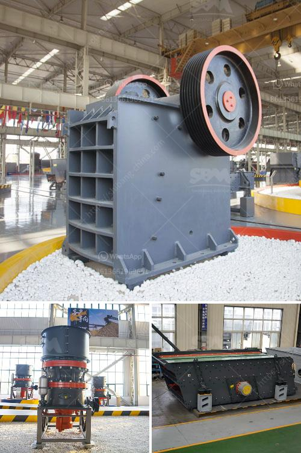

<h3>talcum powder manufacturing process</h3>
Talcum powder, also known as talc, is a soft, white mineral primarily composed of magnesium, silicon, and oxygen. It is commonly used in cosmetic and personal care products due to its ability to absorb moisture and provide a smooth and silky texture. The manufacturing process of talcum powder involves a series of steps to ensure the purity and quality of the end product.

The first step in the talcum powder manufacturing process is mining the talc from natural deposits. Once the ore is extracted, it is transported to a processing plant where it is crushed and ground to a fine powder. The impurities are removed, and the talc is purified through flotation.

Next, the purified talc undergoes a drying process to remove any remaining moisture. Various drying techniques, such as drum drying or spray drying, may be used depending on the desired final product. The drying process not only removes moisture but also helps in obtaining the desired particle size and consistency.

Once the talc is dried, it is then subjected to a milling process. This involves grinding the talc into a fine powder using various types of mills, such as ball mills, jet mills, or roller mills. The milling process provides a uniform particle size distribution, thereby ensuring the smooth and easy application of the powder.

After milling, the talcum powder may undergo further processing to enhance its properties. For instance, some manufacturers may add additional ingredients, such as fragrances or moisturizers, to improve the cosmetic qualities of the powder. These additional ingredients are meticulously blended with the talc powder to ensure homogeneity.

To ensure the safety and quality of the talcum powder, it is crucial to conduct thorough testing of the final product. This includes evaluating its chemical composition, particle size, moisture content, and microbial contamination. The tests help to ensure that the talcum powder abides by the relevant regulations and standards.

The final step in the talcum powder manufacturing process is packaging. The powder is carefully packaged in various forms, such as jars, bottles, or cans, depending on the intended use. The packaging must be designed to protect the powder from moisture and contamination throughout its shelf life.

In conclusion, the manufacturing process of talcum powder involves several crucial steps to ensure the purity, quality, and safety of the final product. From mining and purification to milling and packaging, each stage is carefully executed to meet the stringent standards of the cosmetic and personal care industries. The use of advanced techniques and rigorous testing ensures that talcum powder provides its desired properties, such as absorbency and smoothness. As a result, talcum powder remains a popular choice in various consumer products, contributing to the well-being and comfort of countless individuals worldwide.
<h3>Contact us</h3><ul><li><strong>Whatsapp:&nbsp;<a href="https://wa.me/8613661969651">+8613661969651</a></strong></li><li><a href="https://swt.shibang-china.com/?git&amp;zhl&amp;talcum powder manufacturing process"><strong>Online Service(chat now)</strong></a></li></ul><h3>Related</h3><ul><li><a href='stone crusher plant layout.md'>stone crusher plant layout</a></li><li><a href='river sand suppliers in northern cape.md'>river sand suppliers in northern cape</a></li><li><a href='suppliers of coveyor belting in durban.md'>suppliers of coveyor belting in durban</a></li><li><a href='quarry plant all in one gold mining equipment.md'>quarry plant all in one gold mining equipment</a></li><li><a href='jaw crusher mobile.md'>jaw crusher mobile</a></li></ul>