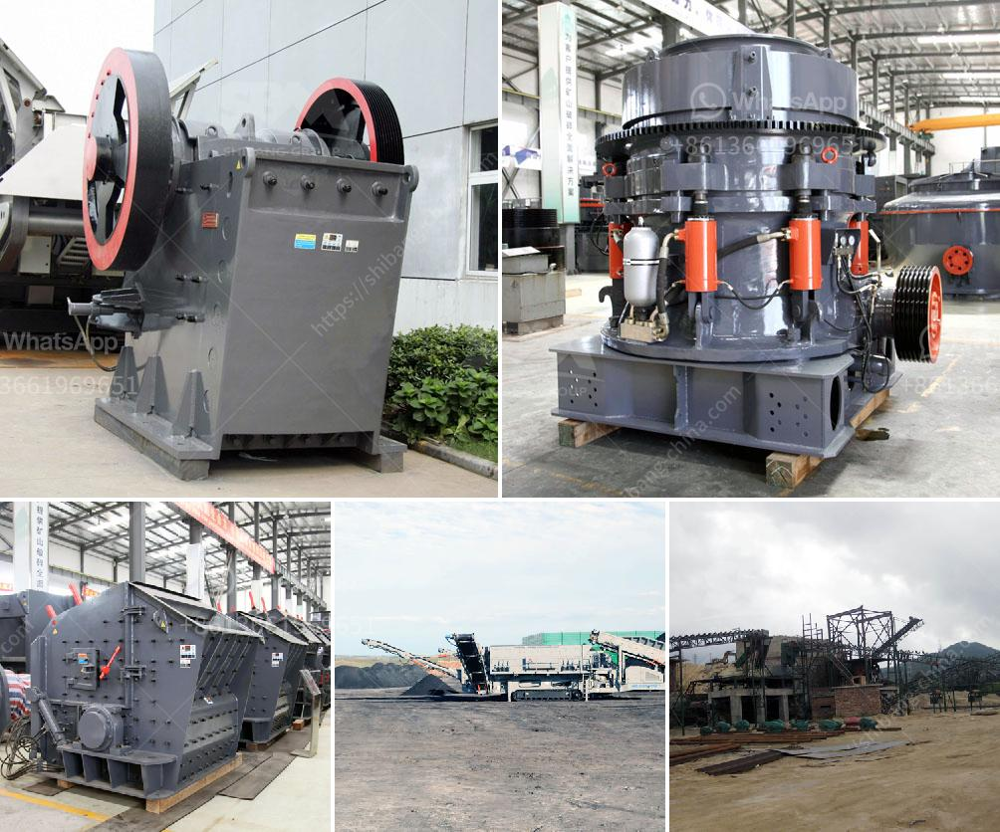

<h3>tanzania stone crusher machine</h3>
Tanzania, in East Africa, is renowned for its rich mineral resources, including gold, silver, diamond, iron, coal, and uranium. Stone quarrying is an important business sector in the country, as the extraction of valuable minerals enables their subsequent processing and commercialization. This is facilitated by the use of advanced machinery, including stone crushing machines, which are essential tools for the mining and construction industries.

Crushing equipment is used to target and break down large-sized rocks into smaller pieces, making them easily transportable and usable. This technology is vital for these industries as it helps increase productivity levels in a cost-effective manner. The stone crusher machine is a machine used to convert large-sized stones into smaller sizes that can be used in construction or other purposes. There are several types of stone crushing machines, which are differentiated based on the stone processing stages, namely primary crusher, secondary crusher, and tertiary crusher.

Each type of stone crusher machine has different functions and outputs. At the primary stage, the jaw crusher is used to reduce the size of stones for further processing. At the secondary stage, the cone crusher is used to further crush larger stones into smaller ones. Lastly, at the tertiary stage, the impact crusher is employed to further reduce the size of the stones into fine particles.

One of the key advantages of using these machines is their versatility and ability to process a wide range of materials, such as limestone, granite, basalt, and many others. This makes them suitable for various industry sectors, including mining, quarrying, construction, infrastructure development, and recycling.

In Tanzania, stone crusher machines are widely used in urban construction sites and quarries. Stone crushing machines work by applying high pressure to the stones to break them into smaller pieces and ultimately achieve the desired end product. It is important to note that jaw crushers and cone crushers are usually used as primary crushing equipment, while impact crushers are commonly used as secondary or tertiary crushing equipment.

In conclusion, stone crusher machines play an important role in the mining and construction industry in Tanzania. As technology continues to advance, the industry's machinery is exposed to significant wear and tear, making regular maintenance crucial. It is essential for businesses operating in this sector to invest in high-quality, reliable stone crushing machines to ensure efficient and productive operations.
<h3>Contact us</h3><ul><li><strong>Whatsapp:&nbsp;<a href="https://wa.me/8613661969651">+8613661969651</a></strong></li><li><a href="https://swt.shibang-china.com/?git&amp;zhl&amp;tanzania stone crusher machine"><strong>Online Service(chat now)</strong></a></li></ul><h3>Related</h3><ul><li><a href='cement mill vertical price in india.md'>cement mill vertical price in india</a></li><li><a href='brand new cone crusher for sale india.md'>brand new cone crusher for sale india</a></li><li><a href='jaw rock crusher for sale.md'>jaw rock crusher for sale</a></li><li><a href='talc grinding plant.md'>talc grinding plant</a></li><li><a href='bentonite and barite milling machines.md'>bentonite and barite milling machines</a></li></ul>