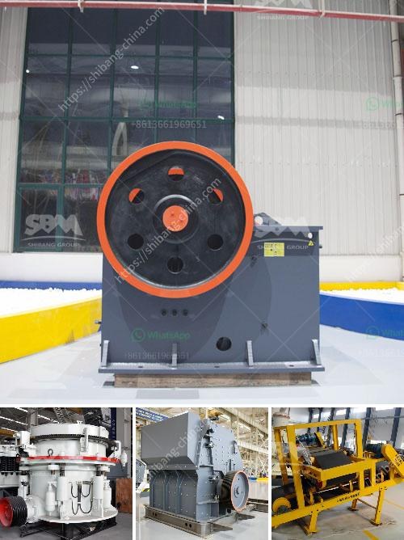

<h3>technical specification limestone milling system</h3>
Limestone is a natural, sedimentary rock that is widely used in various industries such as construction, manufacturing, and agriculture. In order to utilize limestone, it needs to be processed into different sizes and grades. One important aspect of limestone processing is its milling system, which is responsible for grinding and pulverizing the limestone into fine powder. In this article, we will discuss the technical specifications of a typical limestone milling system.

The main component of a limestone milling system is the limestone grinding mill, which is composed of a motor, reducer, grinding roller, grinding plate, blade, and other parts. The limestone grinding mill is designed to operate at a maximum grinding capacity of 50 tons per hour, ensuring that the grinding efficiency is maintained while preserving the quality of the finished product.

The limestone grinding mill is equipped with a direct drive system which eliminates the need for a belt drive and provides a smooth and reliable operation. The motor and reducer are directly connected to the grinding roller shaft, which allows for quick and easy maintenance and reduces downtime.

The grinding roller of the limestone milling system is made of high-quality and wear-resistant materials to ensure its longevity and durability. The grinding roller is designed to rotate at a constant speed, ensuring that the limestone is evenly and efficiently ground. The grinding plate is also made of high-quality materials to ensure its reliability and longevity.

The limestone milling system is equipped with a classification system, which separates the limestone powder into different sizes and grades. The classification system consists of a high-efficiency separator, which is installed at the top of the mill. The high-efficiency separator uses centrifugal force to separate the limestone powder into different sizes, ensuring that the desired particle size is achieved.

The limestone milling system is also equipped with a dust collection system, which collects and removes the dust generated during the milling process. The dust collection system consists of a cyclone separator and a bag filter, which effectively removes the dust particles from the air and prevents them from contaminating the surrounding environment.

In conclusion, a typical limestone milling system is designed to process limestone into fine powder with high efficiency and quality. The system includes a limestone grinding mill, a classification system, and a dust collection system. The limestone milling system is designed to operate at a maximum grinding capacity of 50 tons per hour while ensuring a smooth and reliable operation. By utilizing a direct drive system, high-quality materials, and an efficient classification and dust collection system, the limestone milling system is able to provide a cost-effective and environmentally friendly solution for limestone processing.
<h3>Contact us</h3><ul><li><strong>Whatsapp:&nbsp;<a href="https://wa.me/8613661969651">+8613661969651</a></strong></li><li><a href="https://swt.shibang-china.com/?git&amp;zhl&amp;technical specification limestone milling system"><strong>Online Service(chat now)</strong></a></li></ul><h3>Related</h3><ul><li><a href='cost estimate ball mill.md'>cost estimate ball mill</a></li><li><a href='denver lab jaw crusher.md'>denver lab jaw crusher</a></li><li><a href='mill ore grind size passing 200 mesh.md'>mill ore grind size passing 200 mesh</a></li><li><a href='stone crusher plant in punjab.md'>stone crusher plant in punjab</a></li><li><a href='vibrating screen for fine sand.md'>vibrating screen for fine sand</a></li></ul>