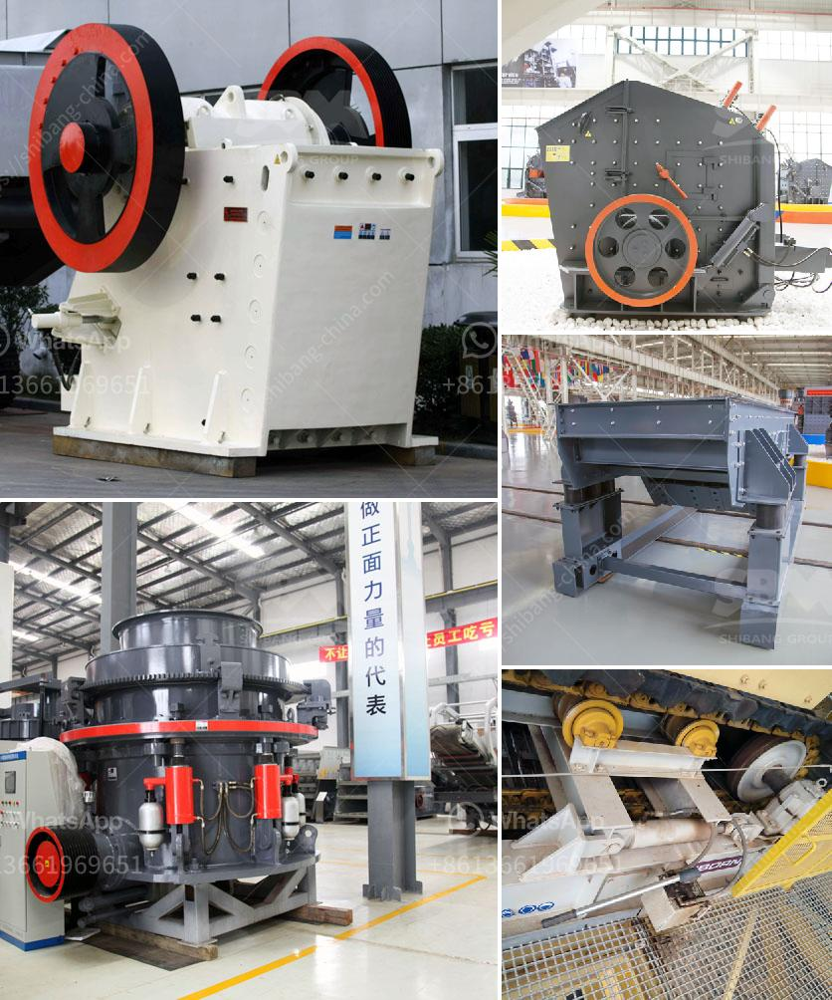

<h3>technical specs 400mm x 600mm jaw crusher</h3>
The 400mm x 600mm jaw crusher is a technical specification for a small to medium-sized jaw crusher and is commonly used in the mining industry. Its small size makes it ideal for projects where space is limited, and its capacity of 30-60 tons per hour ensures high crushing performance.

One of the key features of this jaw crusher is its ability to crush rocks and minerals with a compressive strength of up to 320MPa. This allows it to be used in a wide range of applications, including the processing of hard rock materials such as granite, basalt, and limestone. With its robust construction and durable components, this jaw crusher is designed to withstand the toughest conditions and deliver reliable performance.

The 400mm x 600mm jaw crusher is powered by a highly efficient 37kW electric motor, which provides a high level of power and torque for crushing operations. The motor is coupled with a belt-driven system, ensuring smooth and efficient operation of the crusher. Additionally, the jaw crusher is equipped with a hydraulic adjustment system, which allows for quick and easy adjustments to the closed side setting. This feature allows the user to control the size of the product being produced, ensuring optimal performance and productivity.

The jaw crusher features a large feed opening of 400mm x 600mm, which allows for larger feed sizes and increased production capacity. This makes it suitable for primary crushing applications, where larger rocks need to be reduced in size before further processing. The jaw crusher is also equipped with a hydraulic release system, which helps to protect the crusher from damage caused by uncrushable materials.

In terms of safety, the 400mm x 600mm jaw crusher is designed with several advanced features. It has a fully enclosed body to reduce dust and noise emissions, making it ideal for use in environmentally sensitive areas. The crusher is also equipped with safety guards and emergency stop buttons, ensuring the safety of operators during operation.

Overall, the 400mm x 600mm jaw crusher offers a compact and powerful solution for small to medium-sized crushing operations. Its high crushing capacity, efficient motor power, and adjustable settings make it versatile and suitable for a wide range of applications. Whether used in mining, construction, or recycling, this jaw crusher delivers reliable performance and high productivity.
<h3>Contact us</h3><ul><li><strong>Whatsapp:&nbsp;<a href="https://wa.me/8613661969651">+8613661969651</a></strong></li><li><a href="https://swt.shibang-china.com/?git&amp;zhl&amp;technical specs 400mm x 600mm jaw crusher"><strong>Online Service(chat now)</strong></a></li></ul><h3>Related</h3><ul><li><a href='second hand sand making machine cost.md'>second hand sand making machine cost</a></li><li><a href='sand screens and sieves dealers contacts.md'>sand screens and sieves dealers contacts</a></li><li><a href='stone crashers price in south africa.md'>stone crashers price in south africa</a></li><li><a href='aggregate quarry crusher philippines.md'>aggregate quarry crusher philippines</a></li><li><a href='raymond mill supplier.md'>raymond mill supplier</a></li></ul>