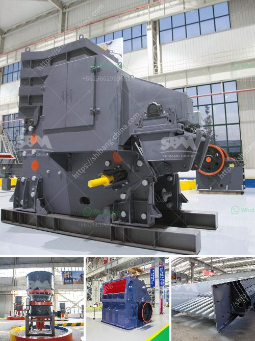

<h3>thailand charcoal briquette machine for sale</h3>
Charcoal briquettes are renowned for their high heat production capacity. They are perfect for barbecues, grilling, and smoking, which makes them one of the most popular fuel sources in Thailand. However, the traditional way of making charcoal briquettes is a lengthy and labor-intensive process. This is where the charcoal briquette machine comes into play.

The charcoal briquette machine for sale in Thailand is highly acclaimed for its environmentally friendly features, low energy consumption, and cost-effectiveness. To fully understand its benefits, let's take a closer look at how it works and why it has become an essential tool for charcoal production in Thailand.

One of the primary advantages of the charcoal briquette machine is that it provides an efficient and convenient way to convert various forms of biomass materials into high-quality charcoal briquettes. These machines use heat and pressure to compress biomass residues, such as sawdust, rice husks, coconut shells, or agricultural waste, into briquettes that can be used as fuel.

By using a charcoal briquette machine, the charcoal production process is streamlined, minimizing waste and maximizing productivity. The machines are designed with advanced technology to ensure consistent and uniform shape and size of the briquettes, making them easier to handle and transport.

Another significant advantage of using a charcoal briquette machine is its positive impact on the environment. Traditional charcoal production methods lead to deforestation as trees are cut down for wood fuel. In contrast, using biomass residues as raw materials for briquette production reduces the demand for wood and decreases deforestation rates.

Furthermore, these machines utilize biomass wastes, which would otherwise be discarded or burned, leading to air pollution. By transforming these wastes into charcoal briquettes, the machines contribute to reducing air pollution, making them an eco-friendly choice.

In addition to being environmentally friendly, the charcoal briquette machine is also cost-effective. The raw materials used to produce briquettes are often readily available or can be obtained at a low cost. This makes charcoal briquettes a more affordable option compared to other traditional fuels, such as coal or wood.

Furthermore, the machines are designed to be energy-efficient, reducing electricity consumption during the production process. This translates to lower operating costs and increased profitability for charcoal producers in Thailand.

The availability of charcoal briquette machines for sale in Thailand has greatly contributed to the growth of the charcoal industry. The machines make it easier for local communities and entrepreneurs to produce high-quality briquettes, without the need for extensive manual labor.

Moreover, the machines can be customized to meet specific production requirements, allowing users to choose the capacity, shape, and size of the briquettes according to their needs. This versatility and flexibility have made charcoal briquette machines a valuable asset for small and large-scale charcoal producers.

In conclusion, the charcoal briquette machine for sale in Thailand offers numerous advantages for the charcoal production industry. Its environmentally friendly features, cost-effectiveness, and streamlined production process make it an ideal choice for both small and large-scale operations. By using these machines, Thailand can promote sustainable charcoal production and reduce its reliance on traditional fuels, contributing to a cleaner and greener future.
<h3>Contact us</h3><ul><li><strong>Whatsapp:&nbsp;<a href="https://wa.me/8613661969651">+8613661969651</a></strong></li><li><a href="https://swt.shibang-china.com/?git&amp;zhl&amp;thailand charcoal briquette machine for sale"><strong>Online Service(chat now)</strong></a></li></ul><h3>Related</h3><ul><li><a href='slag processing plant.md'>slag processing plant</a></li><li><a href='sayaji stone crusher machine.md'>sayaji stone crusher machine</a></li><li><a href='how to make marble powder statues.md'>how to make marble powder statues</a></li><li><a href='sample of project proposal on small scale mining.md'>sample of project proposal on small scale mining</a></li><li><a href='mining equipment used in mining industry.md'>mining equipment used in mining industry</a></li></ul>