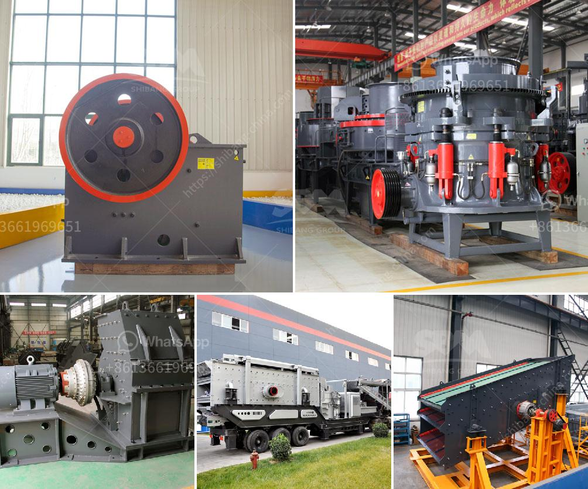

<h3>thailand granite quarry crusher</h3>
Thailand has abundant granite resources, yet the stone extraction industry is still relatively new. As quarrying activities have gained momentum in recent years, there is a need for crushers and grinding mills in granite quarries to effectively crush and grind the granite into smaller pieces. This is crucial for maintaining the quality of the stones in the construction industry.

In Thailand, granite quarry crusher is often used for crushing granite, limestone, marble, sandstone, and other hard rocks into smaller particles. Experts from SBM design a high-efficiency granite quarry crushing plant production line with low price. The granite quarry crushing plant will be able produce crushed stones of various sizes that can be used in various construction and road projects.

The product produced by the crusher is also used for the manufacture of concrete, as well as for the creation of sand and gravel from mined stones. The global demand for crushers is expected to be driven by the heavy construction industry and mining industry. By employing crushers, the investment cost in crushing plants and quarrying activities can be significantly reduced.

Furthermore, Thailand's growing construction industry along with rising investments in infrastructure projects will boost the market for granite quarry crushers. These crushers are capable of crushing large stones into smaller sized stones or even gravel products. They can also be used to crush sandstone, limestone, or even marble. These crushers save time and effort during mining activities, as they can quickly break down the stones into desired sizes.

In conclusion, Thailand's booming granite quarry industry has started to take shape, and the demand for crushers is set to grow in the coming years. With the increasing infrastructure development projects and urbanization, the need for granite is on the rise. Companies are investing in quarrying and crusher plants to meet this demand efficiently and profitably. Thus, the granite quarry crusher industry in Thailand is experiencing a growth trajectory.
<h3>Contact us</h3><ul><li><strong>Whatsapp:&nbsp;<a href="https://wa.me/8613661969651">+8613661969651</a></strong></li><li><a href="https://swt.shibang-china.com/?git&amp;zhl&amp;thailand granite quarry crusher"><strong>Online Service(chat now)</strong></a></li></ul><h3>Related</h3><ul><li><a href='ball clay crusher manufacturing process.md'>ball clay crusher manufacturing process</a></li><li><a href='talcum powder manufacturing process.md'>talcum powder manufacturing process</a></li><li><a href='gold processing machinery in china.md'>gold processing machinery in china</a></li><li><a href='double rotor impact hammer crusher.md'>double rotor impact hammer crusher</a></li><li><a href='coal washing plant cost.md'>coal washing plant cost</a></li></ul>