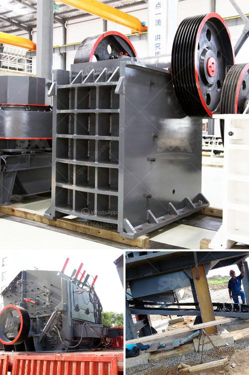

<h3>the biggest crusher manufacturer in china</h3>
China's manufacturing industry has witnessed tremendous growth in the past few decades. With the country becoming a world-leading manufacturing hub, countless companies have emerged in China to cater to the burgeoning demands of various mining and construction industries. In particular, its crusher manufacturing industry is considered to be among the largest globally. This article aims to explore the leading crusher manufacturer in China with the spotlight on its significant products and innovations.

Founded in 1968 and headquartered in Shanghai, China, CITIC Heavy Industries Co., Ltd. (CITIC HIC) has been a global leader in the manufacturing of heavy mining and crushing equipment. In addition to its own range of mining and crushing equipment, CITIC HIC also manufactures mining and cement equipment for others.

CITIC HIC has developed a wide range of crushers, including jaw crushers, gyratory crushers, cone crushers, and impact crushers. Their high-quality products have been widely used in various quarrying and mining applications, such as underground mining, open-pit mining, tunneling, demolition, recycling, and road construction.

One of the primary innovations by CITIC HIC is the development of their MP Series cone crushers. These advanced crushers incorporate the latest technology to deliver high-performance crushing capabilities. The MP Series crushers offer increased reliability, high crushing efficiency, and reduced downtime, making them suitable for large-scale mining and quarrying operations.

Furthermore, CITIC HIC has also made notable advancements in the field of gyratory crushers. Their range of primary gyratory crushers provides exceptional reliability and performance for the toughest applications. These crushers are designed to handle high-capacity crushing and come with innovative features like a hydraulic adjustment system and a remote monitoring system.

With over five decades of experience in the industry, CITIC HIC has been able to establish a strong global presence. Their products are not only widely used in China but are also exported to various countries around the world, including Australia, South Africa, Brazil, Mongolia, and Indonesia. CITIC HIC's commitment to quality, innovation, and customer satisfaction has helped them forge partnerships with leading mining companies globally.

China's crusher manufacturing industry has witnessed significant growth over the years, with several prominent manufacturers emerging in the market. Among them, CITIC Heavy Industries Co., Ltd. stands out as the leading crusher manufacturer in China. With its extensive range of jaw crushers, gyratory crushers, cone crushers, and impact crushers, CITIC HIC offers high-quality crushing equipment and innovative solutions for the mining industry, making it a preferred choice both domestically and internationally.

As the demand for mining and construction equipment continues to rise, CITIC HIC remains committed to driving technological advancements to meet the evolving needs of its customers. With its unwavering commitment to quality, innovation, and global presence, CITIC HIC is poised to maintain its position as China's biggest crusher manufacturer, catering to the growing demand for high-performance crushing equipment in various industries worldwide.
<h3>Contact us</h3><ul><li><strong>Whatsapp:&nbsp;<a href="https://wa.me/8613661969651">+8613661969651</a></strong></li><li><a href="https://swt.shibang-china.com/?git&amp;zhl&amp;the biggest crusher manufacturer in china"><strong>Online Service(chat now)</strong></a></li></ul><h3>Related</h3><ul><li><a href='rock crusher suppliers.md'>rock crusher suppliers</a></li><li><a href='list of equipments needed to start gold mining.md'>list of equipments needed to start gold mining</a></li><li><a href='dolomite processing plant in mexico.md'>dolomite processing plant in mexico</a></li><li><a href='ball mill grinder canada.md'>ball mill grinder canada</a></li><li><a href='granite crusher price in nigeria.md'>granite crusher price in nigeria</a></li></ul>