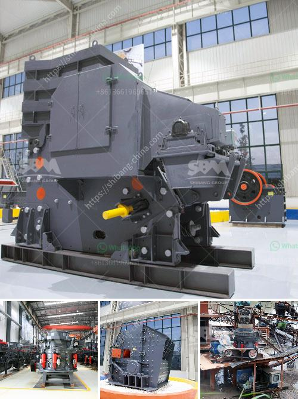

<h3>the cost of the stone crusher machine</h3>
The stone crusher machine is an essential piece of machinery in every construction site. Whether it’s for road construction, building or mining activities, the cost of purchasing this versatile machine is significant. The stone crusher machine can help businesses lower their costs as they are versatile and can crush rocks into different sizes, saving time and money.

The stone crushing machine is flexible enough to incorporate more than one stone crusher. In some cases, a single machine might not be enough to tackle the entire production needs of a business. Thereby, increasing the overall cost of the plant. However, no matter how many crushers are added in the line, one can be assured of achieving the desired output materials and thus bringing revenue to the business.

Additionally, the increase in transportation costs such as fuel, tires, and maintenance costs due to the machines' mobility further escalate the overall cost associated with the machine. In contrast, static crushers require less maintenance and transportation costs.

The initial purchase cost of the stone crusher machine is high in comparison to purchasing a new one or the used ones. The cost involved in purchasing the machine takes into consideration the transportation, shipping, and installation charges incurred. It is advisable to compare prices before choosing the stone crusher machine supplier. From there, choose a reputable supplier who offers good quality at reasonable prices.

Apart from the initial purchase and transportation costs, there are recurring costs associated with the machine in terms of maintenance and upkeep. Regular maintenance, lubrication, and repair expenses can add up to the overall operating costs of the stone crusher machine.

In summary, the stone crusher machine has low operating costs, high productivity, and a wide range of applications. Therefore, investing in a high-quality and efficient machine will enable you to achieve high returns on your investment while also minimizing operating costs.
<h3>Contact us</h3><ul><li><strong>Whatsapp:&nbsp;<a href="https://wa.me/8613661969651">+8613661969651</a></strong></li><li><a href="https://swt.shibang-china.com/?git&amp;zhl&amp;the cost of the stone crusher machine"><strong>Online Service(chat now)</strong></a></li></ul><h3>Related</h3><ul><li><a href='made in germany stone crusher.md'>made in germany stone crusher</a></li><li><a href='are vertical ultrafine mill roller.md'>are vertical ultrafine mill roller</a></li><li><a href='price for ball mills.md'>price for ball mills</a></li><li><a href='biggest rock crusher.md'>biggest rock crusher</a></li><li><a href='vertical mill size distribution.md'>vertical mill size distribution</a></li></ul>