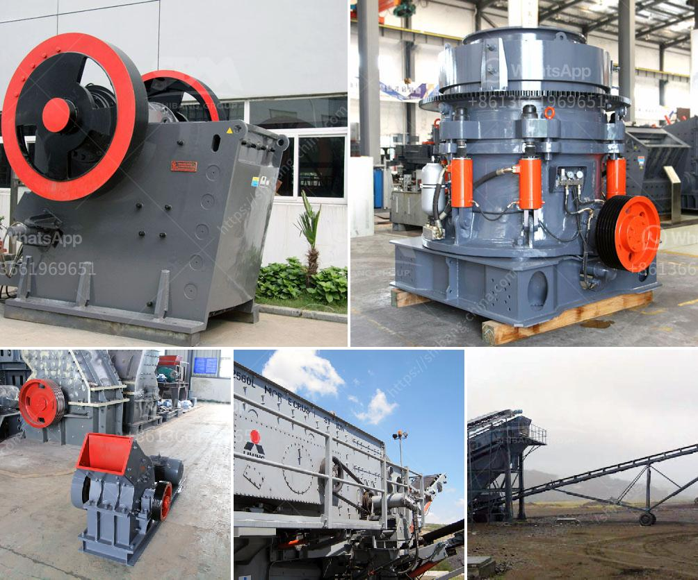

<h3>the highest capacity of granite crusher</h3>
Granite is a rock material known for its exceptional durability, resistance, and aesthetic appeal, making it a popular choice in the construction and landscaping industries. To extract the full potential of this remarkable rock, granite crushers play a crucial role in the granite processing chain. In this article, we will delve into the highest capacity of these crushers, showcasing how they bring forth increased efficiency and productivity within the granite industry.

Granite crushers, also known as stone crushers, are heavy-duty machines designed to break down large granite rocks into smaller, more manageable pieces. They facilitate the extraction, shaping, and refinement of granite, ensuring it can be transported, used, and appreciated in various applications within the construction sector. Acting as primary, secondary, or tertiary crushers, these machines possess different features and capabilities depending on their sizes and power sources.

The highest capacity of a granite crusher refers to the maximum volume or load a particular machine can process within a given timeframe. This capacity is determined by various factors, including the crusher's design, motor power, spindle speed, and the size and type of feed material. High-capacity granite crushers are specifically designed to handle larger volumes of granite and deliver higher productivity to meet project demands efficiently.

High-capacity granite crushers offer significant advantages over their smaller counterparts. They are equipped with larger crushing chambers, wider opening dimensions, and more robust construction, allowing them to handle larger rocks and higher feed capacities. By possessing higher torque and crushing forces, these crushers provide greater power to break down tough granites efficiently.

With advanced technological features such as hydraulic systems, variable speed drives, and automated control systems, high-capacity granite crushers offer smooth operation, precise control over the crushing process, and an ability to adjust crusher settings according to specific requirements. These features enhance the productivity and efficiency of crushing operations, reducing downtime and operating costs.

By maximizing the crushing capacity, high-capacity granite crushers enable quicker processing of raw granite materials. This results in increased productivity, reduced waiting times, and optimized utilization of resources. Contractors and construction companies benefit from decreased turnaround times, faster project completion, and improved profitability through enhanced efficiency.

High-capacity granite crushers have revolutionized the granite processing industry, enabling higher volumes of granite to be processed efficiently and effectively. By incorporating advanced technological features, these machines enhance productivity, reduce downtime, and ultimately contribute to the growth and success of the construction sector.
<h3>Contact us</h3><ul><li><strong>Whatsapp:&nbsp;<a href="https://wa.me/8613661969651">+8613661969651</a></strong></li><li><a href="https://swt.shibang-china.com/?git&amp;zhl&amp;the highest capacity of granite crusher"><strong>Online Service(chat now)</strong></a></li></ul><h3>Related</h3><ul><li><a href='crusher plant germany.md'>crusher plant germany</a></li><li><a href='ball mills in monterrey.md'>ball mills in monterrey</a></li><li><a href='ball mill grinding manufacturer in india.md'>ball mill grinding manufacturer in india</a></li><li><a href='stearic acid coating machine for calcium carbonate.md'>stearic acid coating machine for calcium carbonate</a></li><li><a href='conveyor belt hangzhou.md'>conveyor belt hangzhou</a></li></ul>