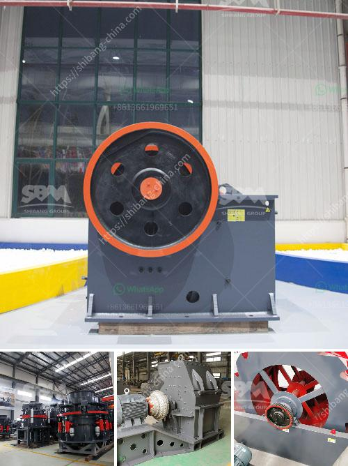

<h3>the process of limestone to cement</h3>
Cement is a crucial component in construction, serving as the binding agent in the creation of concrete. The process of transforming limestone into cement involves a series of complex chemical reactions that require precise control. This article explores the fascinating journey of limestone as it undergoes this transformation, from its extraction from quarries to the final product that strengthens our urban landscapes.

The first step in the process is extracting limestone from quarries. Limestone, a sedimentary rock composed mainly of calcium carbonate, is found in abundance around the world. Quarrying involves the use of heavy machinery to remove large blocks or fragments of limestone from the earth's crust. These blocks are then transported to the cement production plant where they undergo further processing.

Upon arrival at the cement plant, the limestone is carefully crushed into smaller pieces to facilitate the subsequent stages of production. The crushed limestone is then mixed with other materials, including iron ore or clay, that provide the necessary chemical reactions during the cement manufacturing process. These raw materials are carefully selected and proportioned to ensure the desired chemical composition and physical properties of the final product.

The next step is to heat the mixture in a cement kiln, a giant rotating furnace. Inside the kiln, the raw materials are exposed to intense heat at temperatures as high as 2,700 degrees Fahrenheit. This extreme heat causes chemical reactions to occur, resulting in the formation of new compounds known as clinker. Clinker is a hard, nodular material that resembles small marble-like balls.

Once formed, the clinker is cooled and then ground into a fine powder. The grinding process transforms the clinker into cement particles with specific surface areas required for the desired strength and setting properties. The ground cement is then stored in silos until it is ready for packaging and distribution.

The final stage involves mixing cement with other components to form concrete. The cement is combined with aggregates (such as sand and gravel) and water to create a workable mixture that can be molded into various shapes. This mixture is poured into molds or utilized in its fluid state for applications such as spraying or filling.

As the mixture undergoes hydration, a chemical reaction between cement and water occurs, forming a solid matrix that binds all the components together. Over time, the mixture hardens into a robust composite material with impressive compressive strength, making it ideal for construction purposes.

The process of transforming limestone into cement is an intricate one, involving several complex chemical reactions and careful control of various factors. It not only requires the extraction and processing of limestone but also demands expertise in materials science and engineering to ensure the production of high-quality cement.

Cement plays a fundamental role in modern construction, enabling the creation of structures that endure the test of time. The journey of limestone to cement serves as a testament to the remarkable amalgamation of nature's resources with the ingenuity and knowledge of humankind.
<h3>Contact us</h3><ul><li><strong>Whatsapp:&nbsp;<a href="https://wa.me/8613661969651">+8613661969651</a></strong></li><li><a href="https://swt.shibang-china.com/?git&amp;zhl&amp;the process of limestone to cement"><strong>Online Service(chat now)</strong></a></li></ul><h3>Related</h3><ul><li><a href='jaw crusser indonesia.md'>jaw crusser indonesia</a></li><li><a href='mining mobile crusher and washing lebanon.md'>mining mobile crusher and washing lebanon</a></li><li><a href='manganese metal production process.md'>manganese metal production process</a></li><li><a href='beast crusher price.md'>beast crusher price</a></li><li><a href='dedusting systems for crushers.md'>dedusting systems for crushers</a></li></ul>