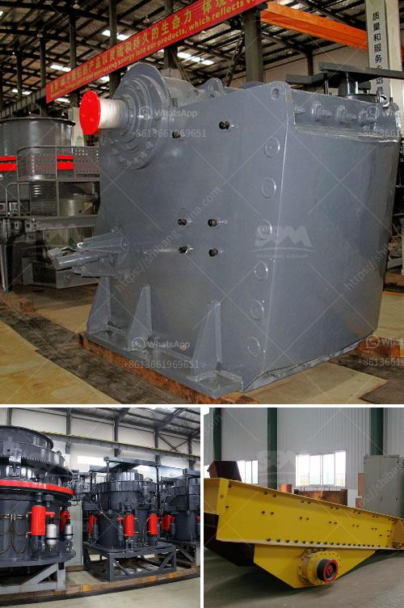

<h3>the roller grinding mill</h3>
Roller grinding mills are becoming increasingly popular in the manufacturing industry. These mills utilize a rotating cylindrical drum with roller grinding balls to grind the material into a fine powder. This powder is then used in various applications, such as cement, ceramics, and coal combustion.

One of the key advantages of roller grinding mills is their ability to grind materials with a wide range of hardness. Whether it is soft limestone or hard iron ore, these mills can handle it all. This versatility makes roller mills a preferred choice for many manufacturers.

Another advantage of roller grinding mills is their high efficiency. The rollers in these mills are designed to crush and grind the material with minimum energy consumption. This not only reduces the manufacturing cost but also helps in preserving the environment by saving energy.

The design of roller grinding mills also ensures a uniform and consistent grinding process. The grinding balls and the rotating drum work together to achieve a well-mixed and evenly ground material. This ensures a high-quality end product with consistent particle size distribution.

Maintenance is also relatively easy with roller grinding mills. The design allows easy access to the rollers and the grinding balls for cleaning and replacement. This helps in reducing downtime and ensures continuous and efficient operation.

In conclusion, roller grinding mills have revolutionized the manufacturing industry by providing a cost-effective and efficient solution for grinding various materials. Their ability to handle different hardness levels and deliver a uniform grinding process makes them a preferred choice for many manufacturers. With easy maintenance and high-energy efficiency, roller grinding mills are here to stay.
<h3>Contact us</h3><ul><li><strong>Whatsapp:&nbsp;<a href="https://wa.me/8613661969651">+8613661969651</a></strong></li><li><a href="https://swt.shibang-china.com/?git&amp;zhl&amp;the roller grinding mill"><strong>Online Service(chat now)</strong></a></li></ul><h3>Related</h3><ul><li><a href='jaw and cone crusher suppliers in mokopane.md'>jaw and cone crusher suppliers in mokopane</a></li><li><a href='lime production process.md'>lime production process</a></li><li><a href='vertical mill manufacturers.md'>vertical mill manufacturers</a></li><li><a href='7 in x 8 in hammer mill gold quarz.md'>7 in x 8 in hammer mill gold quarz</a></li><li><a href='caco3 carbonate calcium line production.md'>caco3 carbonate calcium line production</a></li></ul>