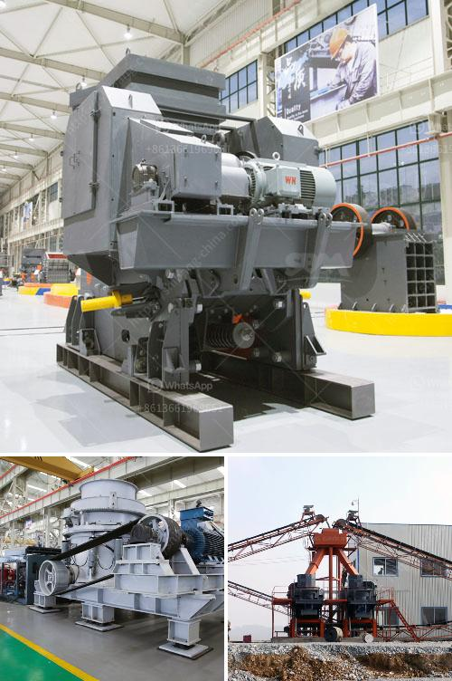

<h3>three roller mill in china</h3>
The three roller mill has played a significant role in shaping China's industrial machinery sector. This versatile equipment, widely used in various industries, has revolutionized manufacturing processes by efficiently reducing particle size, enhancing production capacities, and facilitating consistent product quality. In this article, we explore the key features, applications, and advantages of the three roller mill in China.

The three roller mill, also known as a triple roll mill, consists of three horizontally positioned rolls rotating in opposite directions. These rolls can be adjusted to precisely control the gap between them, allowing the material to pass through and achieve the desired particle size. Generally used for milling, dispersion, and homogenization operations in industries such as cosmetics, pharmaceuticals, and food processing, the three roller mill has become an essential piece of equipment for manufacturers in China.

One of the primary advantages of the three roller mill is its ability to produce a controlled and uniform particle size distribution. This is achieved by the precisely adjustable gap between the rolls, which ensures consistent milling results. By effectively reducing the particle size, manufacturers can obtain fine powders or achieve the desired texture for various products.

The three roller mill operates through the shearing force generated between the rolls, which compresses and grinds the materials. As the rollers rotate, the materials are pulled into the gap between them and subjected to intense pressure. This grinding action efficiently breaks down particles, resulting in improved dispersion, reduced agglomeration, and enhanced mixing.

The versatility of the three roller mill makes it invaluable across several industries. In the cosmetics industry, it is commonly used for producing pigments, creams, and ointments. In the pharmaceutical sector, it facilitates the production of pharmaceutical ingredients, tablets, and various drug formulations. Furthermore, in the food industry, it is applied in the production of chocolates, pastes, and other food products.

The three roller mill offers numerous benefits for manufacturers. It increases production capacities due to its efficient milling process, saves time, and ensures consistent quality across batches. Additionally, it enables manufacturers to experiment with different formulas and ingredients, leading to product innovation and customization.

In China, the three roller mill has become an integral part of the industrial machinery landscape, contributing to the development and growth of various sectors. Its ability to control particle size, promote consistency, and enhance production capacities has made it a vital tool for manufacturers across different industries, guaranteeing product excellence and customer satisfaction.
<h3>Contact us</h3><ul><li><strong>Whatsapp:&nbsp;<a href="https://wa.me/8613661969651">+8613661969651</a></strong></li><li><a href="https://swt.shibang-china.com/?git&amp;zhl&amp;three roller mill in china"><strong>Online Service(chat now)</strong></a></li></ul><h3>Related</h3><ul><li><a href='harga mesin molen di medan.md'>harga mesin molen di medan</a></li><li><a href='cone crusher for salae used.md'>cone crusher for salae used</a></li><li><a href='used crusher in tanzania.md'>used crusher in tanzania</a></li><li><a href='quarry crusher machine.md'>quarry crusher machine</a></li><li><a href='project on stone crushing unit.md'>project on stone crushing unit</a></li></ul>