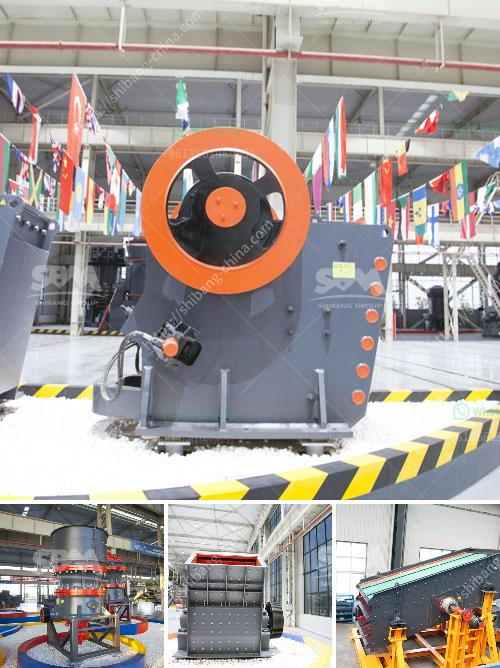

<h3>to buy medium mounted stone crusher in uk</h3>
Are you in need of a specific stone crusher model to expand your construction business or for personal use? If you are based in the UK, you're in luck as there is a variety of medium mounted stone crushers available for purchase. These versatile machines can break down stones of any type and size, making them essential equipment for a wide range of industries.

When looking to buy a medium mounted stone crusher in the UK, there are a few factors that you need to consider:

There are many different types of stone crushers available in the market, including jaw crushers, cone crushers, impact crushers, and compound crushers. Knowing the intended purpose of each type helps determine which one is best suited for your project.

Jaw crushers are ideal for crushing large stones and rocks into smaller particles. These crushers have a stationary jaw and a movable jaw, which forms a crushing chamber where the materials are compressed.

Cone crushers, on the other hand, are more similar to gyratory crushers and operate by crushing the materials between a stationary bowl liner and a moving mantle. They are often used for secondary or tertiary crushing.

Impact crushers utilize impact force to break down stones. They are ideal for processing materials with high abrasiveness or when the shape of the stone is important.

Compound crushers, also known as vertical shaft impact crushers, crush stones by using two parallel rotors rotating at high speeds. They are commonly used for primary or secondary crushing.

Consider the size of the stones you will be crushing and the desired output capacity. This will help determine the size and power requirements of the stone crusher machine. Models with larger feed openings and higher power ratings are capable of processing larger stones and have higher production capacities.

If you require a medium mounted stone crusher machine in your quarry or a mined material preparation plant, it is crucial to have mobility. In order to streamline the process and optimize the throughput, a portable stone crushing plant can be an efficient investment.

A good medium mounted stone crusher machine is considerably expensive. The affordability factor is wide and varied, from sourcing cost, type of stone crusher machine, and the size. If you require medium-scale and large size crushing machines, we recommend a choice of jaw crusher+ impact crusher+cone crusher. It shall be noted that jaw crusher is required for the initial stage of downstream crushing.

Ideally, you should find a reputable seller or manufacturer to get your stone crusher machine. Ensure they provide reliable after-sales support and have a good track record in the industry. Look for feedback and reviews about their products to ensure their credibility.

In conclusion, when choosing a medium mounted stone crusher, it's important to consider the type, size, and output capacity of the machine, as well as the cost, mobility, and reputation of the manufacturer. Buying a quality machine with the right capabilities ensures that you get value for your money and increase productivity in your operations.
<h3>Contact us</h3><ul><li><strong>Whatsapp:&nbsp;<a href="https://wa.me/8613661969651">+8613661969651</a></strong></li><li><a href="https://swt.shibang-china.com/?git&amp;zhl&amp;to buy medium mounted stone crusher in uk"><strong>Online Service(chat now)</strong></a></li></ul><h3>Related</h3><ul><li><a href='rock crusher suppliers.md'>rock crusher suppliers</a></li><li><a href='wiring circuit of grinding machine.md'>wiring circuit of grinding machine</a></li><li><a href='stone crushing plant manufacturers.md'>stone crushing plant manufacturers</a></li><li><a href='basalt rock crusher suppliers in dubai.md'>basalt rock crusher suppliers in dubai</a></li><li><a href='price of large jaw crusher.md'>price of large jaw crusher</a></li></ul>