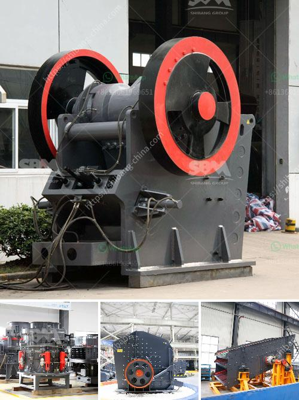

<h3>ton crusher plant price</h3>
The demand for ton crusher plants is continuously growing because of the increasing competition in the market. These machines have a high capacity and they produce cubical shaped aggregate. The crushers in this category can work with feeder-jaw-cone and screen-cone-cone configurations. These machines are commonly used in construction, mining, metallurgy and recycling applications.

The initial cost of a ton crusher plant is quite high. However, the cost of operating the plant is less expensive than other machines, and the hourly production capacity of the plant is higher. The jaw crushers are considered the most important and essential machines for mining and construction industries. With the continuous development of technology, the new types of crushers have been upgraded to improve the overall performance and productivity.

The price of a ton crusher plant ranges from around $10,000 to over $1,000,000, which depends on the features, specifications, and models. The smaller machine models usually have lower prices, while the bigger ones can be relatively expensive due to their high production capacity. These plants can be operated by diesel or electric power, thus the operating cost can vary according to the specific model and power source.

In addition to the initial cost, several factors should be taken into consideration when determining the overall crusher plant price. These factors include the transportation cost, installation cost, maintenance cost, and the cost of spare parts. It is essential to choose a reliable manufacturer and supplier who can offer a reasonable price for the equipment and also provide timely after-sales service.

The output capacity of the ton crusher plants can vary from 80tph to 2000tph, depending on the features and specifications. It is essential to have a clear understanding of the required capacity and the specific requirements of the application before purchasing the machine. The production capacity is usually determined by factors such as the size of the feed material, the hardness of the material, and the required final product size.

In conclusion, the price of a ton crusher plant can vary depending on various factors, including the machine's specifications, features, and the requirements of the application. The cost of operating the plant should also be considered, as well as the installation cost, transportation cost, maintenance cost, and the availability of spare parts. It is recommended to do thorough research and compare prices from different manufacturers to make an informed decision. Considering all these factors will ensure that you find the best value for your investment and achieve the desired production capacity.
<h3>Contact us</h3><ul><li><strong>Whatsapp:&nbsp;<a href="https://wa.me/8613661969651">+8613661969651</a></strong></li><li><a href="https://swt.shibang-china.com/?git&amp;zhl&amp;ton crusher plant price"><strong>Online Service(chat now)</strong></a></li></ul><h3>Related</h3><ul><li><a href='alluvial mining wash plant in canada.md'>alluvial mining wash plant in canada</a></li><li><a href='crusher machine cost.md'>crusher machine cost</a></li><li><a href='manganese ore washing plant and crusher in zambia.md'>manganese ore washing plant and crusher in zambia</a></li><li><a href='feldspar crusher cost.md'>feldspar crusher cost</a></li><li><a href='sand sieving machine by vibrating system chennai.md'>sand sieving machine by vibrating system chennai</a></li></ul>