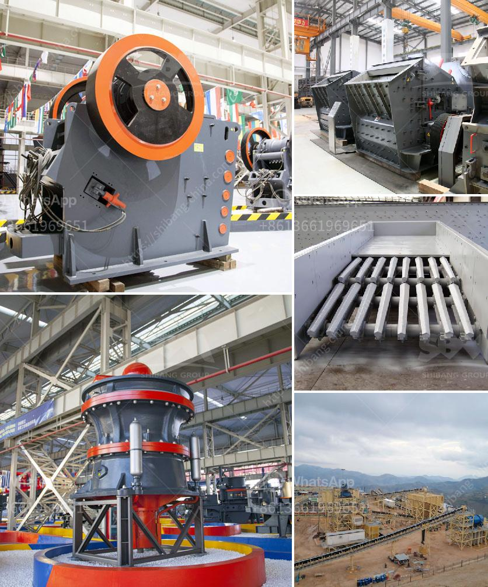

<h3>ton crushing machine</h3>
In today's rapidly evolving industrial landscape, heavy machinery plays a crucial role in achieving unprecedented levels of productivity and efficiency. Among these machines is the ton crushing machine, a powerful device ingeniously designed to transform large, cumbersome objects into smaller, more manageable sizes. From construction sites to mining operations, this tool has become an indispensable asset for various industries worldwide.

The concept behind the ton crushing machine is fairly simple - it uses force to crush materials, ultimately reducing their size or breaking them down into separate components. These machines find extensive application in the construction industry, where they aid in turning large rocks, concrete, and other debris into more usable forms. Additionally, mining operations rely on ton crushing machines to extract minerals from ore, liberating valuable metals efficiently.

One of the key advantages of using a ton crushing machine is its ability to enhance productivity. Traditional methods of breaking down large objects were time-consuming and labor-intensive, requiring significant manpower and resources. With the advent of the ton crushing machine, complex tasks that previously took hours or even days to complete can now be accomplished within minutes.

Furthermore, the versatility of a ton crushing machine makes it highly sought after in various industries. Its ability to handle different types of materials, including concrete, gravel, stone, or even metal, makes it a versatile solution for various applications. Manufacturers have continuously improved the design and functionalities of ton crushing machines, allowing them to adapt to an array of scenarios seamlessly.

Safety is always a paramount concern in any industrial setting, and the developers of ton crushing machines have not overlooked this crucial aspect. Modern ton crushing machines are equipped with advanced safety features to minimize the risk of accidents during operation. Enhanced sensor systems and automated controls ensure that the machine stops immediately if any abnormalities or dangers are detected. This guarantees the well-being of the operators and surrounding personnel, fostering a safe working environment.

Moreover, ton crushing machines contribute to sustainable waste management. Instead of disposing of massive objects and materials in landfills, these machines enable the recycling and reuse of various items. By crushing objects into smaller, more manageable sizes, they promote the efficient utilization of resources, minimizing waste generation and reducing the environmental impact.

In conclusion, the ton crushing machine has revolutionized numerous industries by providing efficient solutions for breaking down large objects. Its ability to enhance productivity, versatility in handling different materials, and focus on safety have made it an indispensable asset in several sectors. Furthermore, its contribution to sustainable waste management underscores its significance in promoting a greener future.

As technology continues to advance, we can expect further innovations in ton crushing machines. Manufacturers are constantly working to improve their designs, incorporating cutting-edge features and functionalities to enhance their overall performance. As a result, businesses will be able to continue reaping the numerous benefits provided by this powerful machine while pushing the boundaries of efficiency and productivity in their respective industries.
<h3>Contact us</h3><ul><li><strong>Whatsapp:&nbsp;<a href="https://wa.me/8613661969651">+8613661969651</a></strong></li><li><a href="https://swt.shibang-china.com/?git&amp;zhl&amp;ton crushing machine"><strong>Online Service(chat now)</strong></a></li></ul><h3>Related</h3><ul><li><a href='vermiculite processing equipment.md'>vermiculite processing equipment</a></li><li><a href='silica sand grinding machine.md'>silica sand grinding machine</a></li><li><a href='stone crusher plates in south africa.md'>stone crusher plates in south africa</a></li><li><a href='cone crusher mobile uk.md'>cone crusher mobile uk</a></li><li><a href='nigeria mobile crusher.md'>nigeria mobile crusher</a></li></ul>